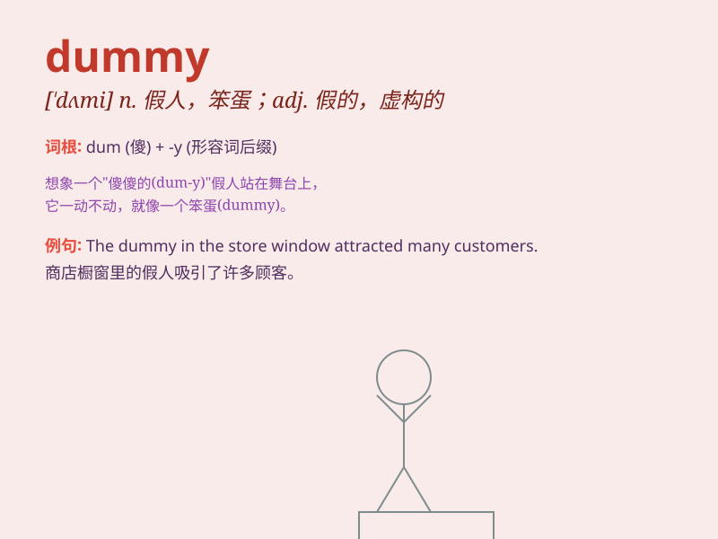

## dummy

**英音:** _[\'dʌmɪ]_ **美音:** _[\'dʌmi]_

**译义:** *n.哑巴,傀儡,假人,假货adj.虚拟的,假的,虚构的n.[计]
哑元*

### 短语

+ **dummy variable:** _虚拟变量；哑变量_

+ **dummy run:** _演习；试演_

+ **dummy load:** _假负载；虚负载_

+ **dummy up:** _保持沉默；守口如瓶_

+ **dummy head:** _仿真头；假人头_

### 例句

#### 例句1

> **The shop window had a dummy dressed in the latest fashion.**

**中文翻译:** 商店橱窗里有一个穿着最新时装的人体模型。

**单词释义:** 人体模型；假人

#### 例句2

> **He made a dummy of himself and hid behind the door.**

**中文翻译:** 他做了一个自己的假像然后藏在门后。

**单词释义:** 仿制品；模拟物

#### 例句3

> **Don\'t be such a dummy! You should know better.**

**中文翻译:** 别这么傻！你应该更明白的。

**单词释义:** 笨蛋；蠢货

### 背诵小故事

>
想象一下，有个商店摆满了假人模特（dummy），它们穿着漂亮衣服却一动不动。一个小孩好奇地去触摸，发现它们只是样子像真人，不能说话也不能动。所以
dummy 就是假的、仿造的东西。

**想象商店里的假人模特帮助理解 dummy 表示假的、仿造的意思的故事。**

### 图义

