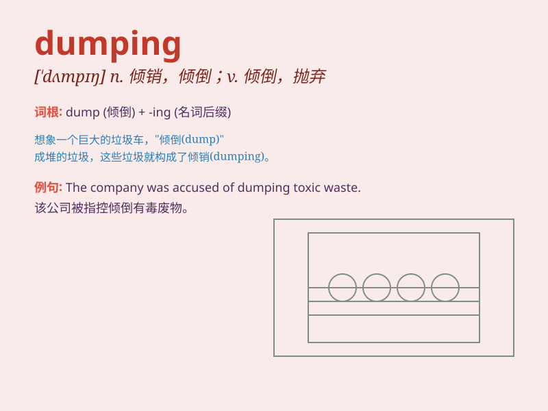

## dumping

**英音:** _[\'dʌmpɪŋ]_ **美音:** _[\'dʌmpɪŋ]_

**译义:** *n.倾销*

### 短语

+ **dumping ground:** _垃圾场；倾倒场_

+ **dumping price:** _倾销价格_

+ **anti-dumping:** _反倾销_

+ **dumping syndrome:** _倾倒综合征_

+ **dumping site:** _倾倒地点；垃圾倾倒场_

### 例句

#### 例句1

> **The company was accused of dumping toxic waste into the
river.**

**中文翻译:** 这家公司被指控向河里倾倒有毒废物。

**单词释义:** 倾倒；倾销

#### 例句2

> **They were caught dumping stolen goods on the black market.**

**中文翻译:** 他们被抓到在黑市上倾销赃物。

**单词释义:** 倾销；抛售

#### 例句3

> **She found her boyfriend dumping her for another girl.**

**中文翻译:** 她发现她的男朋友为了另一个女孩抛弃了她。

**单词释义:** 抛弃；甩掉

### 背诵小故事

> A factory was accused of dumping toxic waste into the river. The bad
smell and dead fish made people very angry. Finally, the factory was
punished. Remember, dumping is illegally throwing away things.

**一家工厂被指控向河里倾倒有毒废物。难闻的气味和死鱼让人们非常愤怒。最后，这家工厂受到了惩罚。记住，dumping
就是非法丢弃东西。**

### 图义

