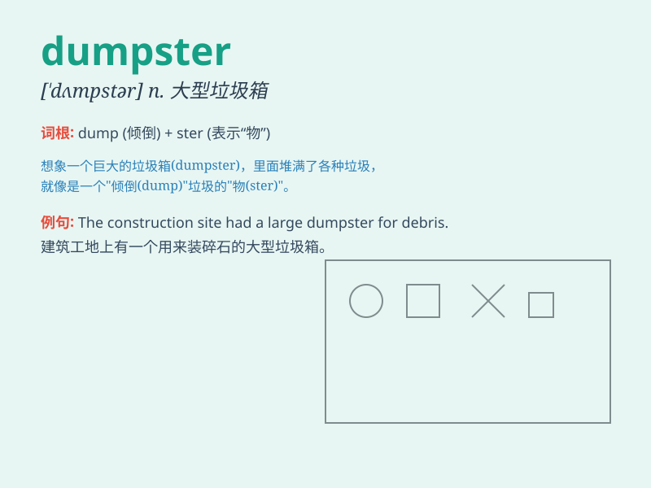

## dumpster

**英音:** _[ˈdʌm.stər]_ **美音:** _[ˈdʌm.stər]_

**译义:** *n.大型垃圾箱，垃圾车*

### 短语

+ **dumpster diving:** _翻找垃圾桶（以寻找有价值的物品）_

+ **dumpster fire:** _形容情况极度混乱或糟糕_

+ **dumpster rental:** _垃圾桶租赁_

+ **dumpster lid:** _垃圾桶盖_

+ **dumpster area:** _垃圾桶放置区域_

### 例句

#### 例句1

> **The dumpster behind the restaurant was overflowing with
garbage.**

**中文翻译:** 餐厅后面的垃圾桶里堆满了垃圾。

**单词释义:** 垃圾桶

#### 例句2

> **He threw the old furniture into the dumpster.**

**中文翻译:** 他把旧家具扔进了垃圾桶。

**单词释义:** 垃圾桶

#### 例句3

> **The dumpster is too heavy to move.**

**中文翻译:** 这个垃圾桶太重了，搬不动。

**单词释义:** 垃圾桶

### 背诵小故事

> One day, Tom was walking along the street and saw a huge dumpster. It
was full of old furniture and broken toys. He thought about how people
throw away things they don\'t need in the dumpster.

**一天，汤姆走在街上，看到一个巨大的垃圾桶。里面装满了旧家具和坏掉的玩具。他想到人们是如何把不需要的东西扔到垃圾桶里的。**

### 图义

