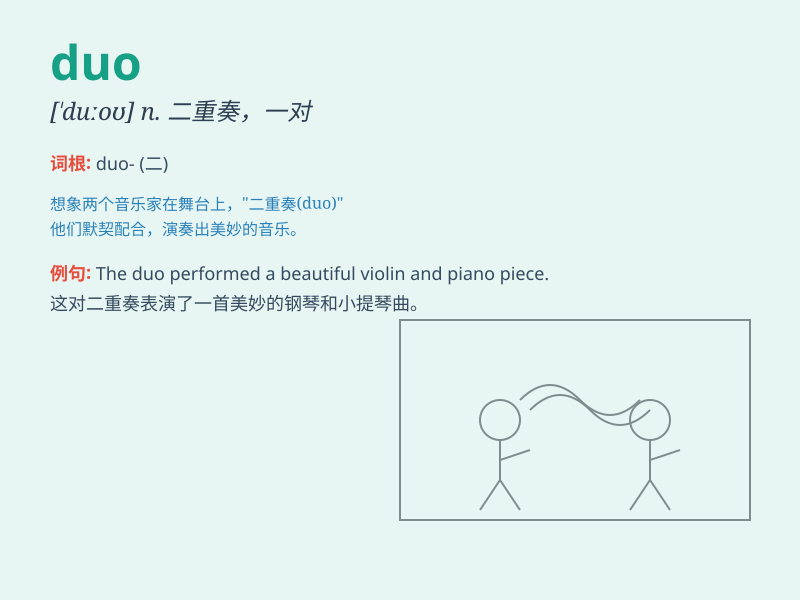

## duo

**英音:** _[\'djuːəʊ]_ **美音:** _[\'duo]_

**译义:** *n.\<意> 二重唱,艺人的一对*

### 短语

+ **musical duo:** _音乐二人组_

+ **comedy duo:** _喜剧二人组_

+ **dynamic duo:** _活力二人组；最佳搭档_

+ **inseparable duo:** _形影不离的二人组_

+ **powerful duo:** _强大的二人组_

### 例句

#### 例句1

> **The musical duo performed a beautiful song.**

**中文翻译:** 这对音乐组合表演了一首优美的歌曲。

**单词释义:** 一对，一组（尤指两个人）

#### 例句2

> **The comedy duo had the audience laughing throughout the show.**

**中文翻译:** 这对喜剧搭档在整个表演中让观众笑声不断。

**单词释义:** 一对，一组（尤指两个人）

#### 例句3

> **The dynamic duo worked together seamlessly to complete the
project.**

**中文翻译:** 这对活力搭档完美协作完成了这个项目。

**单词释义:** 一对，一组（尤指两个人）

### 背诵小故事

> Two musicians formed a duo. They practiced hard every day. One played
the guitar and the other sang. Their performances were amazing. People
loved their duo.

**两位音乐家组成了一个二重奏组合。他们每天都刻苦练习。一个弹吉他，另一个唱歌。他们的表演令人惊叹。人们喜欢他们的组合。**

### 图义

