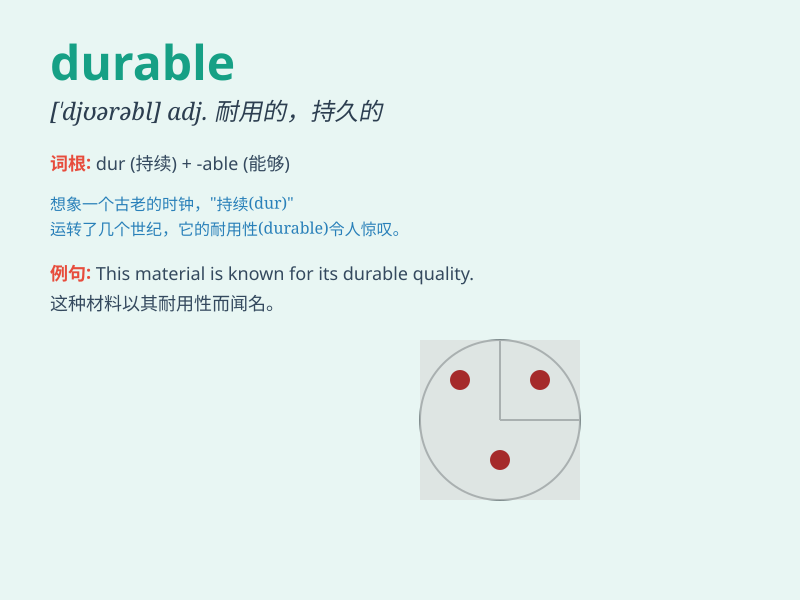

## durable

**英音:** _[\'djʊərəb(ə)l]_ **美音:** _[\'dʊrəbl]_

**译义:** *adj.持久的,耐用的*

### 短语

+ **durable goods:** _耐用品_

+ **durable material:** _耐用材料_

+ **durable peace:** _持久和平_

+ **durable relationship:** _持久的关系_

+ **durable solution:** _持久的解决方案_

### 例句

#### 例句1

> **This sofa is made of durable fabric and can withstand heavy
use.**

**中文翻译:** 这张沙发是用耐用的面料制成的，可以承受重度使用。

**单词释义:** 耐用的；持久的

#### 例句2

> **The company is known for producing durable electronic
devices.**

**中文翻译:** 这家公司以生产耐用的电子设备而闻名。

**单词释义:** 耐用的；持久的

#### 例句3

> **She bought a durable pair of shoes for hiking.**

**中文翻译:** 她买了一双耐用的鞋子用于徒步旅行。

**单词释义:** 耐用的；持久的

### 背诵小故事

> A traveler was lost in a storm. Luckily, he found a durable tent that
protected him from the harsh weather. The tent didn\'t break or tear,
showing its ability to last. \'Durable\' means able to withstand wear,
pressure, or damage.

**一位旅行者在暴风雨中迷路了。幸运的是，他找到了一顶耐用的帐篷，保护他免受恶劣天气的影响。帐篷没有破裂或撕裂，显示出其持久的能力。\'durable\'意思是经久耐用的，能承受磨损、压力或损坏。**

### 图义

