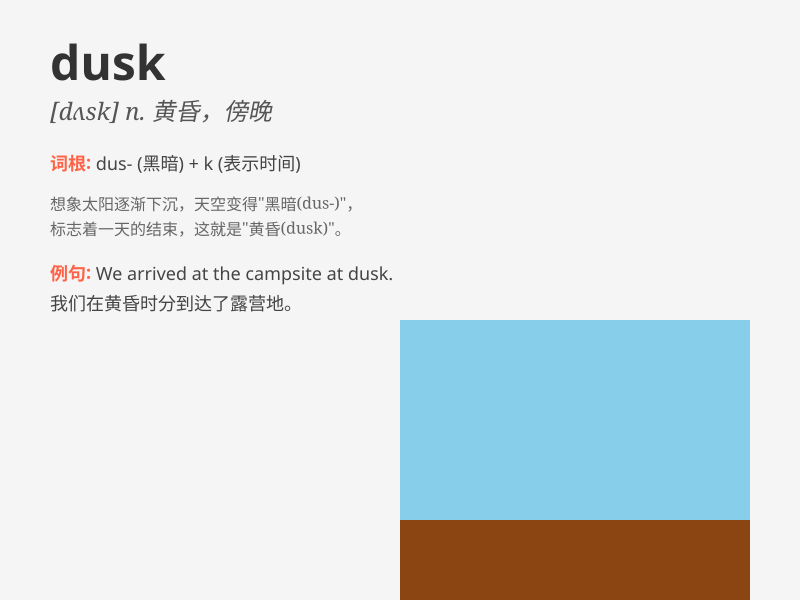

## dusk

**英音:** _[dʌsk]_ **美音:** _[dʌsk]_

**译义:** *n.薄暮,黄昏*

### 短语

+ **at dusk:** _在黄昏；傍晚时分_

+ **before dusk:** _在黄昏之前_

+ **after dusk:** _黄昏之后_

+ **dusk to dawn:** _从黄昏到黎明_

+ **in the dusk:** _在黄昏中_

### 例句

#### 例句1

> **The street lights come on at dusk.**

**中文翻译:** 街灯在黄昏时分亮起。

**单词释义:** 黄昏；薄暮

#### 例句2

> **We arrived home at dusk.**

**中文翻译:** 我们在黄昏时到家。

**单词释义:** 黄昏；傍晚

#### 例句3

> **The birds fly back to their nests at dusk.**

**中文翻译:** 鸟儿在黄昏时飞回巢里。

**单词释义:** 黄昏；暮色

### 背诵小故事

> One day, a little boy was playing outside. As the sun began to set
and the sky turned a shade of purple and orange, it was dusk. The boy
knew it was time to go home for dinner.

**有一天，一个小男孩在外面玩耍。当太阳开始落山，天空变成了紫色和橙色的混合色时，这就是黄昏。小男孩知道该回家吃晚饭了。**

### 图义

