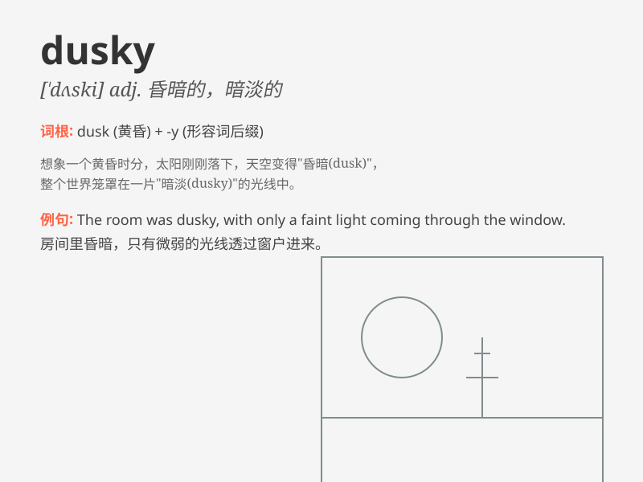

## dusky

**英音:** _[\'dʌskɪ]_ **美音:** _[\'dʌski]_

**译义:** *adj.微暗的,朦胧的,忧郁的*

### 短语

+ **dusky complexion:** _黝黑的肤色_

+ **dusky night:** _昏暗的夜晚_

+ **dusky hue:** _暗淡的色调_

+ **dusky room:** _昏暗的房间_

+ **dusky path:** _幽暗的小路_

### 例句

#### 例句1

> **The dusky sky signaled the approach of night.**

**中文翻译:** 昏暗的天空预示着夜晚的来临。

**单词释义:** 昏暗的

#### 例句2

> **She has dusky skin and beautiful eyes.**

**中文翻译:** 她有着黝黑的皮肤和美丽的眼睛。

**单词释义:** 黝黑的

#### 例句3

> **The room was filled with a dusky light.**

**中文翻译:** 房间里充满了昏暗的光线。

**单词释义:** 昏暗的

### 背诵小故事

> A dusky night, a little girl got lost in the forest. The sky was dark
and she felt scared. But then she saw a dusky light in the distance and
followed it to find her way home. The light was like a guide in the
darkness.

**在一个昏暗的夜晚，一个小女孩在森林里迷路了。天空很黑，她感到害怕。但随后她看到远处有一丝昏暗的光线，跟着它找到了回家的路。那光线就像黑暗中的向导。**

### 图义

