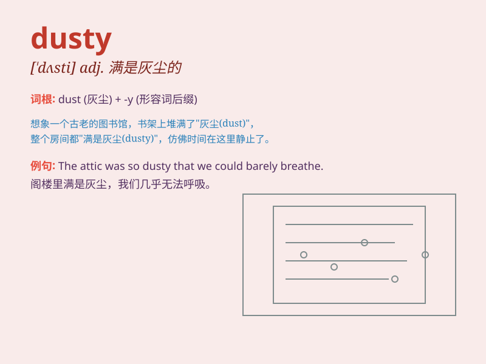

## dusty

**英音:** _[\'dʌstɪ]_ **美音:** _[\'dʌsti]_

**译义:** *adj.满是灰尘的,积满灰尘的,粉末状的,含糊的*

### 短语

+ **dusty road:** _布满灰尘的道路_

+ **dusty room:** _满是灰尘的房间_

+ **dusty bookshelf:** _布满灰尘的书架_

+ **dusty corner:** _积灰的角落_

+ **dusty attic:** _满是灰尘的阁楼_

### 例句

#### 例句1

> **The room was dusty and needed a good cleaning.**

**中文翻译:** 房间里满是灰尘，需要好好打扫一下。

**单词释义:** 布满灰尘的

#### 例句2

> **She wore a dusty pair of jeans.**

**中文翻译:** 她穿着一条布满灰尘的牛仔裤。

**单词释义:** 满是灰尘的

#### 例句3

> **The old books on the shelf were dusty and forgotten.**

**中文翻译:** 书架上的旧书满是灰尘，被遗忘了。

**单词释义:** 布满灰尘的

### 背诵小故事

> A little mouse was exploring an old house. It entered a dusty room
filled with cobwebs. The dust made the mouse sneeze. But it was still
curious and kept looking around. Remember, \'dusty\' means covered with
dust.

**一只小老鼠正在探索一座老房子。它进入了一个布满蜘蛛网且满是灰尘的房间。灰尘让老鼠打起了喷嚏。但它仍然很好奇，继续四处查看。记住，'dusty'意思是布满灰尘的。**

### 图义

