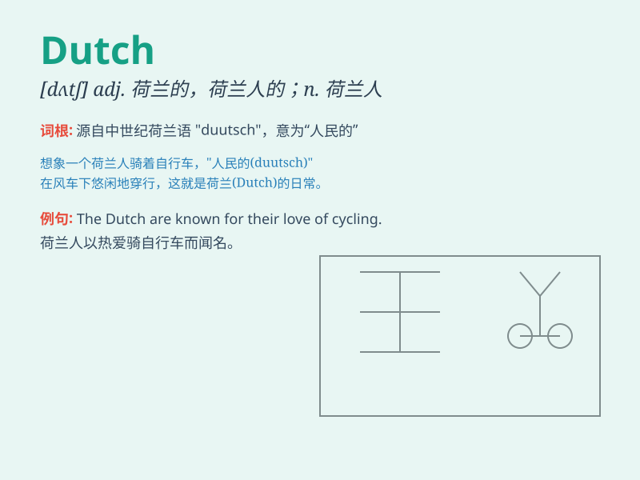

## Dutch

**英音:** _[dʌtʃ]_ **美音:** _[dʌtʃ]_

**译义:** *adj.荷兰的；荷兰人的；荷兰语的n.荷兰人；荷兰语*

### 短语

+ **Dutch courage:** _酒后之勇_

+ **go Dutch:** _各自付账；平摊费用_

+ **Dutch treat:** _各付己账；各自付费的聚餐或娱乐活动_

+ **in Dutch:** _处于困境；失宠；遇到麻烦_

+ **Dutch uncle:** _严厉或直率地批评人的人_

### 例句

#### 例句1

> **The Dutch are known for their tulips.**

**中文翻译:** 荷兰人以他们的郁金香而闻名。

**单词释义:** 荷兰的；荷兰人的

#### 例句2

> **I learned Dutch when I was studying abroad.**

**中文翻译:** 我在国外学习时学习了荷兰语。

**单词释义:** 荷兰语

#### 例句3

> **They went on a Dutch treat dinner.**

**中文翻译:** 他们去吃了一顿各自付费的晚餐。

**单词释义:** 各自付费的

### 背诵小故事

> Once upon a time, there was a Dutch boy who was very good at
painting. He used his talent to show the beauty of his homeland. People
loved his works and remembered him as a symbol of Dutch art.

**从前，有一个荷兰男孩非常擅长绘画。他用自己的天赋展现了祖国的美丽。人们喜欢他的作品，并把他视为荷兰艺术的象征。**

### 图义

