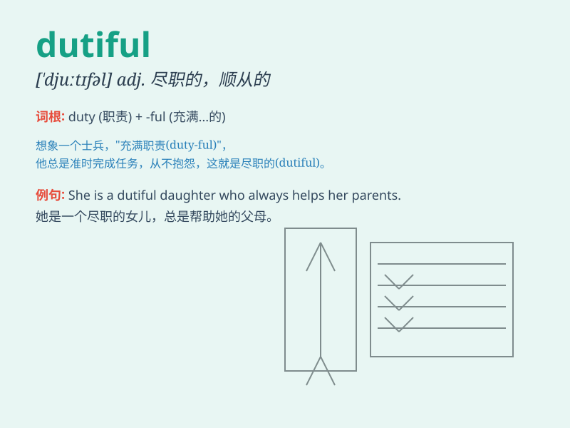

## dutiful

**英音:** _[\'djuːtɪfʊl; -f(ə)l]_ **美音:**
_[\'dʊtɪfəl]_

**译义:** *adj.忠实的,顺从的,守本分的,恭敬的,孝敬的*

### 短语

+ **dutiful daughter:** _孝顺的女儿_

+ **dutiful citizen:** _尽职的公民_

+ **dutiful servant:** _尽职的仆人_

+ **dutiful performance:** _尽职的表现_

+ **dutiful attitude:** _尽职的态度_

### 例句

#### 例句1

> **He is a dutiful son who always takes care of his parents.**

**中文翻译:** 他是一个孝顺的儿子，总是照顾父母。

**单词释义:**
尽职的；顺从的；守本分的（形容儿子对照顾父母的职责尽到了）

#### 例句2

> **The dutiful employee arrives at work early every day.**

**中文翻译:** 这位尽职尽责的员工每天都早到上班。

**单词释义:** 尽职的（形容员工对工作的尽责）

#### 例句3

> **She was a dutiful wife, supporting her husband through thick and
thin.**

**中文翻译:** 她是一位尽职的妻子，无论风雨同舟，都支持丈夫。

**单词释义:** 顺从的；守本分的（形容妻子对丈夫的支持）

### 背诵小故事

> Once upon a time, there was a dutiful soldier. He always followed
orders and fulfilled his duties without complaint. His sense of
responsibility made him a model for others. Remember, \'dutiful\' means
having a strong sense of duty and being obedient.

**从前，有一位尽职的士兵。他总是毫无怨言地听从命令并履行职责。他的责任感使他成为其他人的榜样。记住，\'dutiful\'意思是有强烈的责任感并且顺从。**

### 图义

