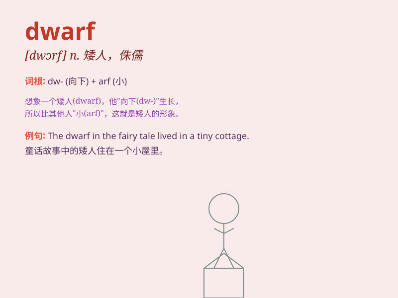

## dwarf

**英音:** _[dwɔːf]_ **美音:** _[dwɔrf]_

**译义:** *n.矮子,侏儒v.(使)变矮小*

### 短语

+ **dwarf star:** _矮星_

+ **dwarf planet:** _矮行星_

+ **dwarf tree:** _矮树_

+ **dwarf shrub:** _矮灌木丛_

+ **dwarf variety:** _矮生品种_

### 例句

#### 例句1

> **The dwarf tree was perfect for the small garden.**

**中文翻译:** 这棵矮树非常适合小花园。

**单词释义:** 矮小的

#### 例句2

> **The new building dwarfed the old ones in the neighborhood.**

**中文翻译:** 新建筑使附近的旧建筑相形见绌。

**单词释义:** 使相形见绌

#### 例句3

> **The dwarf planet Pluto was once considered a full-fledged
planet.**

**中文翻译:** 矮行星冥王星曾经被认为是一颗成熟的行星。

**单词释义:** 矮的；矮小的（用于天文学中）

### 背诵小故事

> Once upon a time, in a magical forest, there was a little creature
called a dwarf. He was very short but had great wisdom. He could find
hidden treasures that others couldn\'t. His small size didn\'t stop him
from having big adventures.

**从前，在一个神奇的森林里，有一个叫做矮人的小生物。他个子很矮但非常有智慧。他能找到别人找不到的隐藏宝藏。他小小的身材并没有阻止他进行大冒险。**

### 图义

