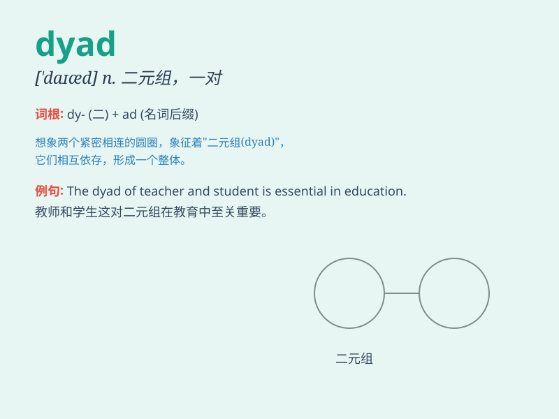

## dyad

**英音:** _[\'daɪæd]_ **美音:** _[\'daɪæd]_

**译义:** *n.对,双,成对物n.[化] 二价元素n.[生物]
二分体,一对染色体*

### 短语

+ **dyad system:** _二元体系_

+ **dyad analysis:** _二元分析_

+ **dyad symmetry:** _二元对称_

+ **chromosome dyad:** _染色体二价体_

+ **dyad relationship:** _二元关系_

### 例句

#### 例句1

> **The dyad of husband and wife has a strong bond.**

**中文翻译:** 夫妻二人的感情十分深厚。

**单词释义:** 二人组合；一对

#### 例句2

> **In mathematics, a dyad is a pair of vectors.**

**中文翻译:** 在数学中，二元组是一对向量。

**单词释义:** 二元组；成对的事物

#### 例句3

> **The dyad of teacher and student worked closely on the
project.**

**中文翻译:** 教师和学生二人在该项目上密切合作。

**单词释义:** 一对；两个一组

### 背诵小故事

> A dyad is like a pair of twins who always stick together. They share
everything and move as one. Just imagine the inseparable bond of the
twins to remember the meaning of dyad - a pair or group of two.

**一个二元组就像一对总是黏在一起的双胞胎。他们分享一切，行动一致。想象一下这对形影不离的双胞胎，就能记住
dyad 这个词的意思------一对或一组两个。**

### 图义

