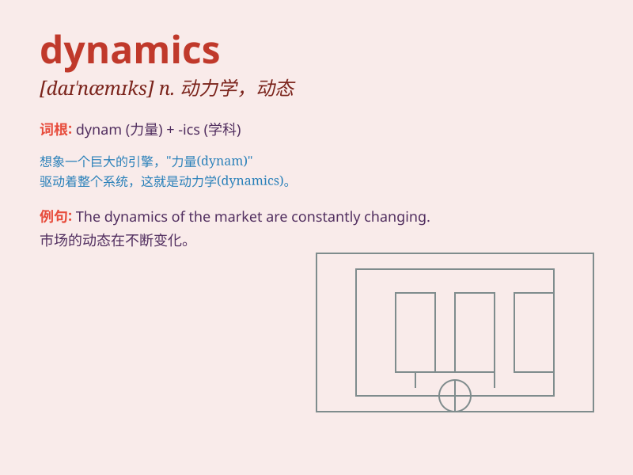

## dynamics

**英音:** _[daɪ\'næmɪks]_ **美音:** _[daɪ\'næmɪks]_

**译义:** *n.动力学*

### 短语

+ **group dynamics:** _群体动力学_

+ **market dynamics:** _市场动态_

+ **social dynamics:** _社会动态_

+ **dynamics of change:** _变化的动态_

+ **population dynamics:** _人口动态_

### 例句

#### 例句1

> **The dynamics of the market have changed significantly in recent
years.**

**中文翻译:** 近年来，市场动态发生了显着变化。

**单词释义:** 动态；动力学

#### 例句2

> **Group dynamics can have a big impact on team performance.**

**中文翻译:** 团队动态会对团队绩效产生重大影响。

**单词释义:** 动力学；动态

#### 例句3

> **She is studying the dynamics of interpersonal relationships.**

**中文翻译:** 她正在研究人际关系的动态。

**单词释义:** 动态

### 背诵小故事

> A group of scientists was studying the dynamics of a pendulum. They
observed how its movement changed based on different forces. The
pendulum\'s dynamics showed them the complex relationship between speed
and force.

**一群科学家正在研究一个钟摆的动力学。他们观察它的运动如何基于不同的力而改变。钟摆的动力学向他们展示了速度和力之间复杂的关系。**

### 图义

