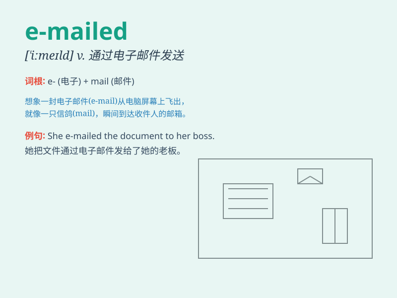

## e-mailed

**英音:** _[ˈiːmeɪld]_ **美音:** _[ˈiːmeɪld]_

**译义:** *v. （给......）发电子邮件；用电邮发送（e-mail
的过去式和过去分词）*

### 短语

+ **e-mailed message:** _电子邮件消息_

+ **e-mailed attachment:** _电子邮件附件_

+ **e-mailed invitation:** _电子邮件邀请函_

+ **e-mailed confirmation:** _电子邮件确认_

+ **e-mailed report:** _电子邮件报告_

### 例句

#### 例句1

> **I e-mailed my friend to tell her the good news.**

**中文翻译:** 我给我的朋友发电子邮件告诉她这个好消息。

**单词释义:** 发送电子邮件

#### 例句2

> **He e-mailed the report to his boss last night.**

**中文翻译:** 他昨晚把报告用电子邮件发给了他的老板。

**单词释义:** 用电子邮件发送

#### 例句3

> **She e-mailed me her travel photos.**

**中文翻译:** 她给我发电子邮件分享了她的旅行照片。

**单词释义:** 通过电子邮件发送

### 背诵小故事

> One day, Tom was very excited because he e-mailed his best friend in
another city and shared his happy news. The e-mail flew through the
internet quickly, connecting their hearts.

**有一天，汤姆非常兴奋，因为他给在另一个城市的最好的朋友发了电子邮件，并分享了他的好消息。这封电子邮件迅速通过网络传送，连接了他们的心。**

### 图义

