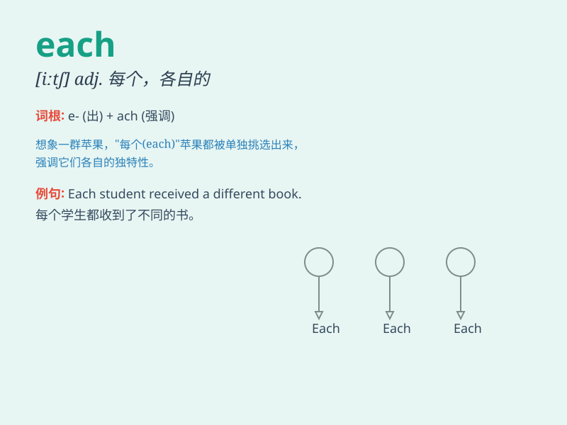

## each

**英音:** _[iːtʃ]_ **美音:** _[itʃ]_

**译义:** *adj.各自的,每个的,每一 pron.各,各自,每个adv.每个*

### 短语

+ **each other:** _彼此；互相_

+ **each time:** _每次；每当_

+ **each one:** _每一个_

+ **each of:** _......中的每一个_

+ **in each case:** _在每种情况下_

### 例句

#### 例句1

> **Each student has a different learning style.**

**中文翻译:** 每个学生都有不同的学习风格。

**单词释义:** 每个

#### 例句2

> **They gave each other presents on Christmas Day.**

**中文翻译:** 他们在圣诞节那天互赠礼物。

**单词释义:** 彼此

#### 例句3

> **Each time I see her, she looks happier.**

**中文翻译:** 每次我见到她，她看起来都更开心。

**单词释义:** 每次

### 背诵小故事

> There was a race. Each runner was very determined. They all wanted to
be the first. But in the end, only one could win. \'Each\' here means
every single one.

**有一场赛跑。每个跑步者都很坚定。他们都想成为第一。但最后，只有一个人能赢。这里的'each'意思是每一个。**

### 图义

