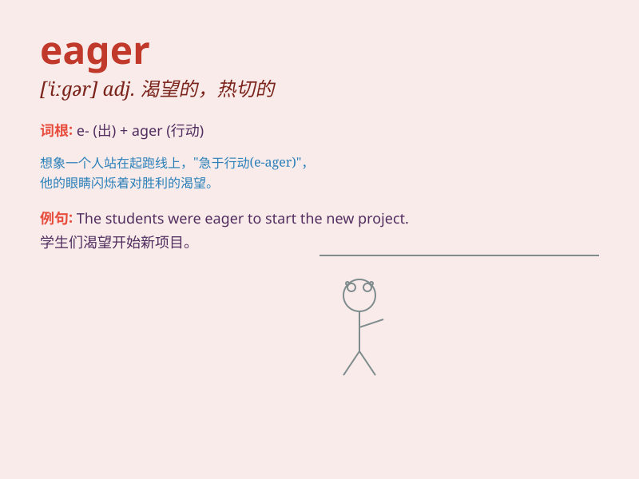

## eager

**英音:** _[\'iːgə]_ **美音:** _[\'igɚ]_

**译义:** *adj.热心于,渴望着*

### 短语

+ **be eager for:** _渴望，渴求_

+ **be eager to do sth:** _渴望做某事_

+ **eager anticipation:** _热切的期待_

+ **eager eyes:** _热切的目光_

+ **eager beaver:** _干活特别卖力的人；勤奋的人_

### 例句

#### 例句1

> **She is eager to learn new skills.**

**中文翻译:** 她渴望学习新技能。

**单词释义:** 渴望

#### 例句2

> **The children were eager for the party to start.**

**中文翻译:** 孩子们急切地盼望着聚会开始。

**单词释义:** 急切

#### 例句3

> **He is always eager to help others.**

**中文翻译:** 他总是热衷于帮助别人。

**单词释义:** 热衷于

### 背诵小故事

> A little rabbit was eager to find the biggest carrot in the garden.
It hopped around quickly, looking everywhere. Its eagerness made it not
give up until it found the prize.

**一只小兔子非常渴望在花园里找到最大的胡萝卜。它快速地跳来跳去，到处寻找。它的渴望让它不放弃，直到找到了奖品。**

### 图义

