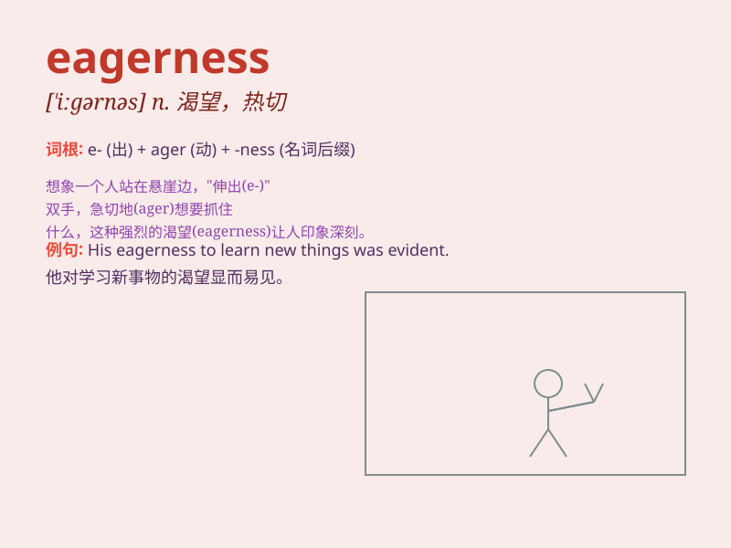

## eagerness

**英音:** _[ˈiːgənɪs]_ **美音:** _[ˈigərnəs]_

**译义:** *n.热心*

### 短语

+ **with eagerness:** _热切地；渴望地_

+ **eagerness to learn:** _学习的渴望_

+ **show eagerness:** _表现出渴望_

+ **eagerness for success:** _对成功的渴望_

+ **great eagerness:** _极大的渴望_

### 例句

#### 例句1

> **She accepted the invitation with eagerness.**

**中文翻译:** 她热切地接受了邀请。

**单词释义:** 热切，渴望

#### 例句2

> **His eagerness to learn impressed the teacher.**

**中文翻译:** 他渴望学习的热情给老师留下了深刻的印象。

**单词释义:** 渴望，热情

#### 例句3

> **They set off with eagerness for the adventure.**

**中文翻译:** 他们满怀渴望地出发去冒险。

**单词释义:** 渴望，急切

### 背诵小故事

> A little bird was always full of eagerness. It wanted to fly higher
than others. Every day, it practiced hard with eagerness. Finally, it
became the best flyer.

**一只小鸟总是充满渴望。它想飞得比其他鸟都高。每天，它都带着渴望努力练习。最终，它成为了飞得最好的鸟。**

### 图义

