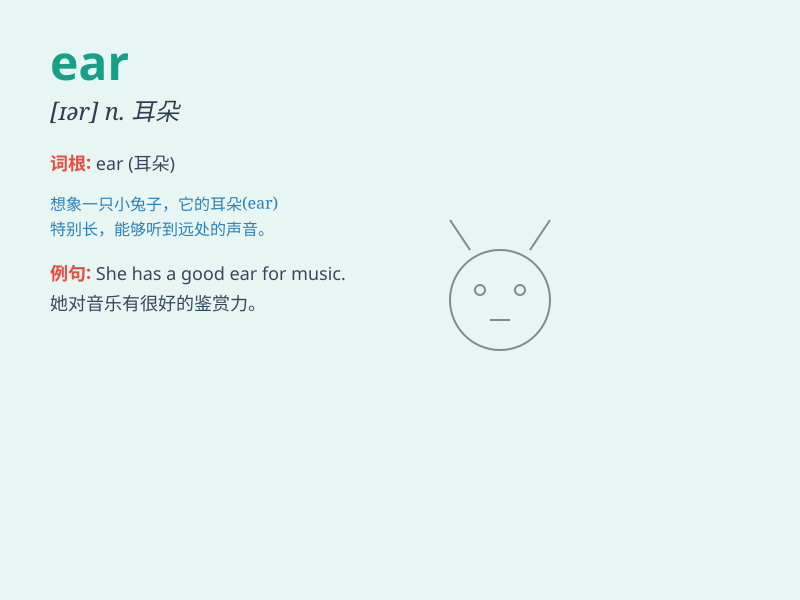

## ear

**英音:** _[ɪə]_ **美音:** _[ɪr]_

**译义:** *n.耳朵,倾听,听觉,听力,穗vi.抽穗*

### 短语

+ **inner ear:** _内耳_

+ **middle ear:** _中耳_

+ **outer ear:** _外耳_

+ **lend an ear:** _倾听；注意听_

+ **be all ears:** _全神贯注地听；洗耳恭听_

### 例句

#### 例句1

> **She has a pair of pretty ears.**

**中文翻译:** 她有一对漂亮的耳朵。

**单词释义:** 耳朵

#### 例句2

> **He turned a deaf ear to my advice.**

**中文翻译:** 他对我的建议充耳不闻。

**单词释义:** 耳朵（此处指倾听的能力）

#### 例句3

> **The corn is just beginning to ear.**

**中文翻译:** 玉米刚刚开始抽穗。

**单词释义:** 抽穗

### 背诵小故事

> One day, a little mouse was running around. Suddenly, it heard a
strange sound with its sharp ear. It stopped and listened carefully.
Then it found a big cat was coming. Thanks to its ear, the mouse ran
away quickly.

**有一天，一只小老鼠正在到处跑。突然，它用灵敏的耳朵听到一个奇怪的声音。它停下来仔细听。然后它发现一只大猫来了。多亏了它的耳朵，小老鼠迅速跑掉了。**

### 图义

