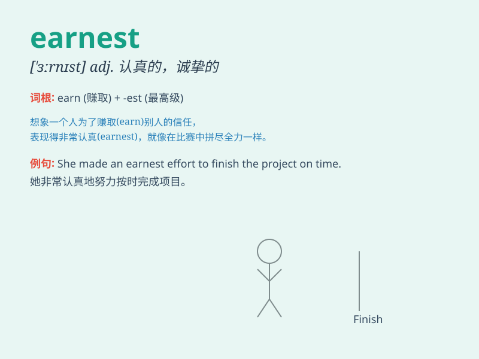

## earnest

**英音:** _[ˈɜːnɪst]_ **美音:** _[ˈɜːrnɪst]_

**译义:** *adj.认真的,热心的,重要的n.真挚,定金,认真,热心*

### 短语

+ **in earnest:** _认真地；诚挚地；郑重其事地_

+ **earnest money:** _定金；保证金_

+ **earnest desire:** _热切的愿望_

+ **earnest appeal:** _恳切的呼吁_

+ **earnest effort:** _认真的努力_

### 例句

#### 例句1

> **He was in earnest when he said he wanted to help.**

**中文翻译:** 当他说他想帮忙时，他是认真的。

**单词释义:** 认真的

#### 例句2

> **She made an earnest attempt to learn French.**

**中文翻译:** 她认真地尝试学习法语。

**单词释义:** 认真的；诚挚的

#### 例句3

> **The earnest young man was determined to succeed.**

**中文翻译:** 这位认真的年轻人决心要成功。

**单词释义:** 认真的；坚定的

### 背诵小故事

> A young artist was always earnest in his pursuit of perfect
paintings. He spent hours every day, with a serious expression, working
hard. His earnestness finally paid off when his artworks were highly
praised.

**一位年轻的艺术家总是非常认真地追求完美的画作。他每天都花好几个小时，表情严肃，努力工作。他的认真最终得到了回报，他的作品受到了高度赞扬。**

### 图义

