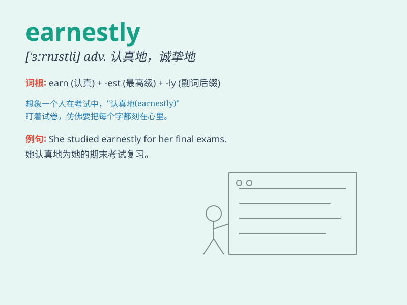

## earnestly

**英音:** _[ˈɜːnɪstli]_ **美音:** _[ˈɜːrnɪstli]_

**译义:** *adv.认真地,诚挚地*

### 短语

+ **earnestly hope:** _真诚地希望_

+ **earnestly seek:** _认真寻求_

+ **earnestly request:** _恳切请求_

+ **earnestly study:** _认真学习_

+ **earnestly pray:** _虔诚祈祷_

### 例句

#### 例句1

> **He earnestly pleaded for forgiveness.**

**中文翻译:** 他诚恳地请求原谅。

**单词释义:** 诚恳地

#### 例句2

> **She earnestly studied for the exam.**

**中文翻译:** 她认真地为考试学习。

**单词释义:** 认真地

#### 例句3

> **They earnestly discussed the plan.**

**中文翻译:** 他们热切地讨论这个计划。

**单词释义:** 热切地

### 背诵小故事

> A little boy wanted to buy a gift for his mother earnestly. So he did
many chores to earn money. His hard work and sincerity showed how
earnestly he desired to make his mother happy.

**一个小男孩非常渴望给妈妈买一份礼物。于是他做了很多家务来挣钱。他的努力和真诚展现了他是多么认真地想要让妈妈开心。**

### 图义

