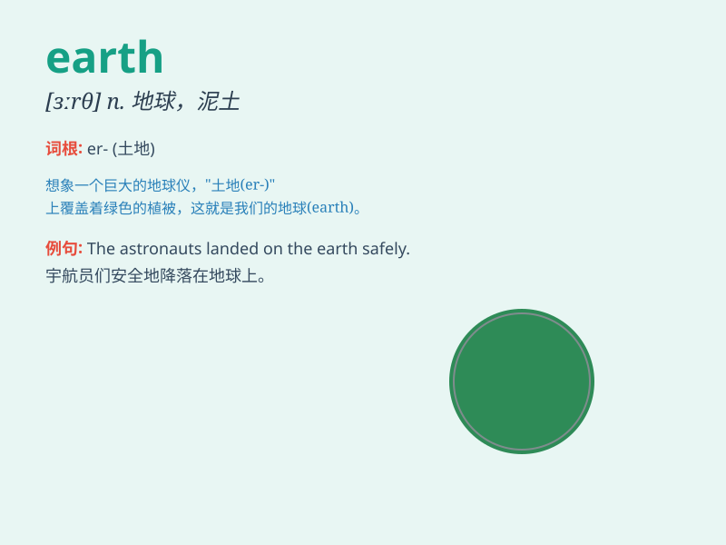

## earth

**英音:** _[ɜːθ]_ **美音:** _[ɝθ]_

**译义:**
*n.地球,陆地,泥土,洞穴,地球上的人类,尘世,[电]接地vt.埋入土中,把\...赶入洞内,把\...接地vi.躲入洞内*

### 短语

+ **on earth:** _究竟；到底_

+ **down to earth:** _务实的；实际的_

+ **move heaven and earth:** _竭尽全力；想方设法_

+ **run to earth:** _追踪到；查找到_

+ **earth up:** _培土；用土覆盖_

### 例句

#### 例句1

> **The earth moves around the sun.**

**中文翻译:** 地球绕着太阳转。

**单词释义:** 地球

#### 例句2

> **He dug deep into the earth to find treasure.**

**中文翻译:** 他深挖土地以寻找宝藏。

**单词释义:** 土地；泥土

#### 例句3

> **The bird returned to earth after flying high in the sky.**

**中文翻译:** 这只鸟在高空飞翔后回到了地面。

**单词释义:** 地面

### 背诵小故事

> One day, a little alien landed on Earth. He was amazed by the blue
sky, green plants and beautiful mountains. He decided to explore this
wonderful planet and learn about its mysteries.

**有一天，一个小外星人降落在地球上。他对蓝天、绿色植物和美丽的山脉感到惊讶。他决定探索这个奇妙的星球并了解它的奥秘。**

### 图义

