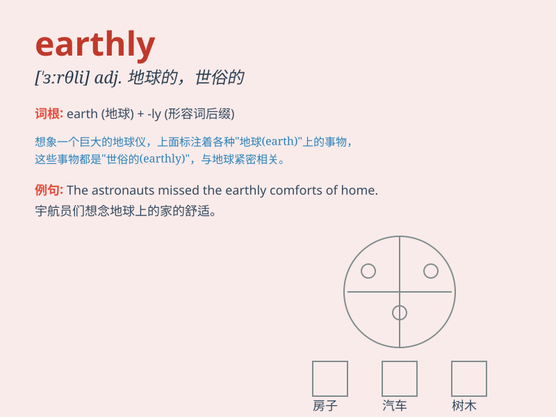

## earthly

**英音:** _[\'ɜːθlɪ]_ **美音:** _[\'ɝθli]_

**译义:** *adj.现世的,可能的,地球的,俗世的,*

### 短语

+ **earthly paradise:** _人间天堂_

+ **earthly possessions:** _尘世财产_

+ **earthly concern:** _世俗的忧虑_

+ **earthly power:** _世俗权力_

+ **earthly wisdom:** _世俗的智慧_

### 例句

#### 例句1

> **There is no earthly reason for her to be so angry.**

**中文翻译:** 她没有任何实际的理由这么生气。

**单词释义:** 实际的；可能的

#### 例句2

> **What earthly good would that do?**

**中文翻译:** 那究竟会有什么好处？

**单词释义:** 究竟；到底

#### 例句3

> **I have no earthly idea what he\'s talking about.**

**中文翻译:** 我根本不知道他在说什么。

**单词释义:** 丝毫；根本

### 背诵小故事

> Once upon a time, there was a little alien who came to Earth. He was
confused about everything here and shouted, \'I have no earthly idea
what\'s going on!\' meaning he had no idea at all.

**从前，有一个小外星人来到地球。他对这里的一切感到困惑并喊道：'我一点都不明白这是怎么回事！'这里的'earthly'表示'一点，丝毫'**

### 图义

