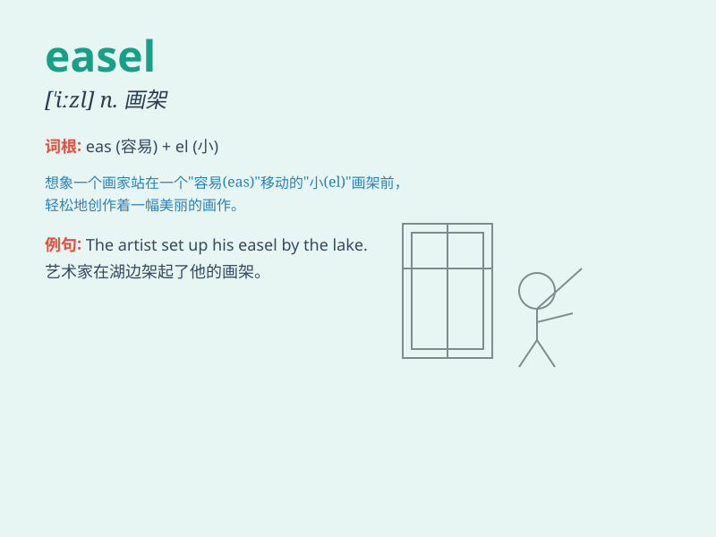

## easel

**英音:** _[\'iːz(ə)l]_ **美音:** _[\'izl]_

**译义:** *n.画架,黑板架*

### 短语

+ **portable easel:** _便携式画架_

+ **artist\'s easel:** _画家的画架_

+ **adjustable easel:** _可调节的画架_

+ **wooden easel:** _木制画架_

+ **folding easel:** _折叠式画架_

### 例句

#### 例句1

> **The artist set up his canvas on the easel in the studio.**

**中文翻译:** 这位艺术家在工作室里把他的画布放在画架上。

**单词释义:** 画架

#### 例句2

> **She bought a new easel for her outdoor painting sessions.**

**中文翻译:** 她为户外绘画时段买了一个新画架。

**单词释义:** 画架

#### 例句3

> **The easel was too small for the large painting he was working
on.**

**中文翻译:** 这个画架对于他正在创作的大幅画作来说太小了。

**单词释义:** 画架

### 背诵小故事

> A painter was always in trouble because his easel kept falling. One
day, he fixed it and finally could paint peacefully. The easel became
his reliable partner.

**一位画家总是遇到麻烦，因为他的画架老是倒下。有一天，他修好了画架，终于能够安静地作画了。画架成了他可靠的伙伴。**

### 图义

