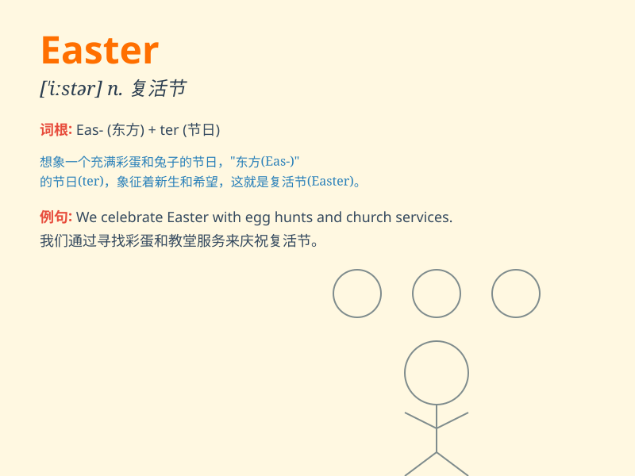

## Easter

**英音:** _[ˈiːstə]_ **美音:** _[ˈistər]_

**译义:**
*n.复活节（基督教纪念耶稣复活的节日，通常在春分月圆之后的第一个星期日）*

### 短语

+ **Easter Bunny:** _复活节兔子_

+ **Easter egg:** _复活节彩蛋_

+ **Easter holiday:** _复活节假期_

+ **Easter parade:** _复活节游行_

+ **Easter Sunday:** _复活节星期日_

### 例句

#### 例句1

> **Easter is a significant religious holiday for Christians.**

**中文翻译:** 复活节对于基督徒来说是一个重要的宗教节日。

**单词释义:** 复活节

#### 例句2

> **We usually have a big family dinner on Easter.**

**中文翻译:** 我们通常在复活节有一顿丰盛的家庭晚餐。

**单词释义:** 复活节

#### 例句3

> **Children love hunting for Easter eggs.**

**中文翻译:** 孩子们喜欢寻找复活节彩蛋。

**单词释义:** 复活节

### 背诵小故事

> A little rabbit was very excited for Easter. It hopped around,
looking for colorful eggs. Finally, it found a big basket full of eggs
and treats. Easter is a time of joy and celebration!

**一只小兔子对复活节非常兴奋。它蹦蹦跳跳地四处寻找彩色的蛋。最后，它找到了一个装满蛋和美食的大篮子。复活节是欢乐和庆祝的时刻！**

### 图义

