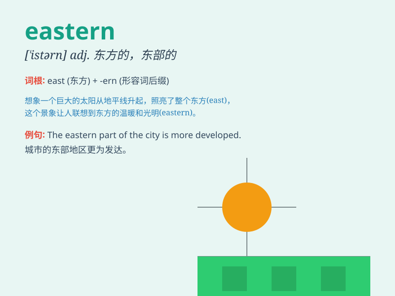

## eastern

**英音:** _[\'iːst(ə)n]_ **美音:** _[\'istɚn]_

**译义:** *adj.东方的,东部的*

### 短语

+ **eastern Europe:** _东欧_

+ **eastern culture:** _东方文化_

+ **eastern hemisphere:** _东半球_

+ **eastern country:** _东方国家_

+ **eastern customs:** _东方习俗_

### 例句

#### 例句1

> **The eastern part of the country is known for its beautiful
beaches.**

**中文翻译:** 该国东部地区以其美丽的海滩而闻名。

**单词释义:** 东部的

#### 例句2

> **She has a deep interest in Eastern culture.**

**中文翻译:** 她对东方文化有着浓厚的兴趣。

**单词释义:** 东方的

#### 例句3

> **The eastern wind brought a refreshing coolness.**

**中文翻译:** 东风带来了一阵沁人心脾的凉意。

**单词释义:** 东方的；从东方来的

### 背诵小故事

> A brave explorer set off on a journey to the eastern lands. There, he
saw beautiful sunrises and met friendly people. The unique culture and
landscapes made his adventure unforgettable. Remember, eastern means
related to the east.

**一位勇敢的探险家踏上了前往东部地区的旅程。在那里，他看到了美丽的日出，还遇到了友好的人们。独特的文化和风景让他的冒险难以忘怀。记住，eastern
意思是与东方有关的。**

### 图义

