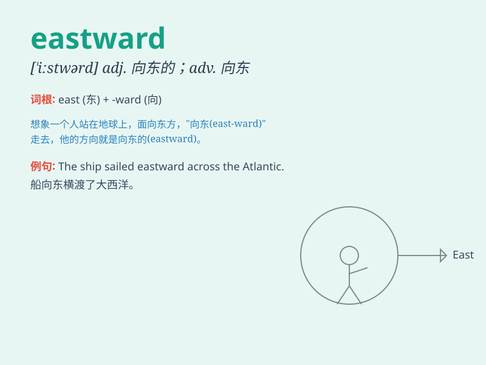

## eastward

**英音:** _[\'iːstwəd]_ **美音:** _[\'istwɚdz]_

**译义:** *adv.向东adj.向东的,朝东的*

### 短语

+ **eastward journey:** _向东的旅程_

+ **eastward direction:** _向东的方向_

+ **move eastward:** _向东移动_

+ **eastward expansion:** _向东扩张_

+ **look eastward:** _朝东看_

### 例句

#### 例句1

> **The birds flew eastward in search of warmer climates.**

**中文翻译:** 鸟儿向东飞去寻找温暖的气候。

**单词释义:** 向东

#### 例句2

> **They decided to travel eastward along the coast.**

**中文翻译:** 他们决定沿着海岸向东行驶。

**单词释义:** 向东

#### 例句3

> **The wind blew eastward, carrying the smell of the sea.**

**中文翻译:** 风向东吹，带着大海的味道。

**单词释义:** 向东

### 背诵小故事

> A brave adventurer set off on a journey eastward. He followed the
rising sun, passing through beautiful valleys and climbing over high
mountains. His goal was to reach the mysterious land in the east.

**一位勇敢的冒险家踏上了向东的旅程。他追随着升起的太阳，穿过美丽的山谷，翻越过高山。他的目标是到达东边那片神秘的土地。**

### 图义

