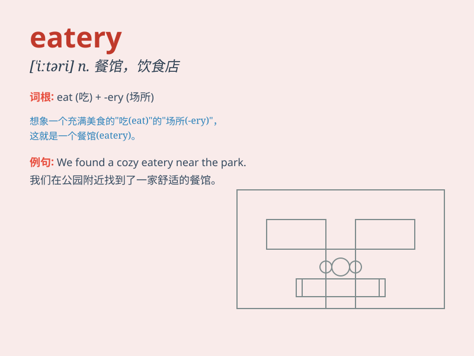

## eatery

**英音:** _[\'iːtərɪ]_ **美音:** _[\'itəri]_

**译义:** *n.\<美>餐馆,食堂*

### 短语

+ **fast eatery:** _快餐店_

+ **local eatery:** _当地的餐馆_

+ **small eatery:** _小餐馆_

+ **popular eatery:** _受欢迎的餐馆_

+ **family eatery:** _家庭餐馆_

### 例句

#### 例句1

> **We went to a new eatery for dinner last night.**

**中文翻译:** 昨晚我们去了一家新餐馆吃晚饭。

**单词释义:** 餐馆

#### 例句2

> **The local eatery is always crowded during lunchtime.**

**中文翻译:** 午餐时间，当地的餐馆总是人满为患。

**单词释义:** 餐馆

#### 例句3

> **I discovered a charming eatery near the park.**

**中文翻译:** 我在公园附近发现了一家迷人的餐馆。

**单词释义:** 餐馆

### 背诵小故事

> One day, Tom was very hungry. He searched everywhere and finally
found an eatery. There were many delicious foods. He enjoyed his meal
happily.

**一天，汤姆非常饿。他到处寻找，最后找到了一家小餐馆。那里有很多美味的食物。他开心地享用了一顿。**

### 图义

