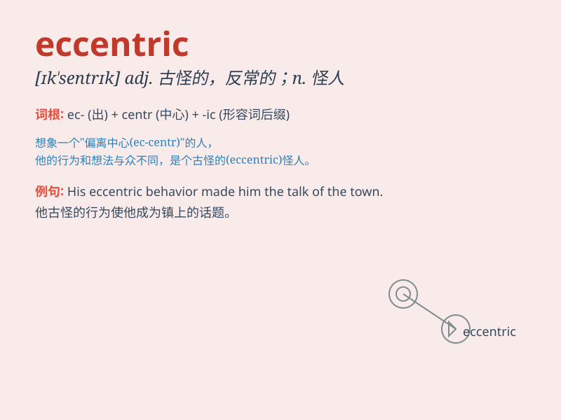

## eccentric

**英音:** _[ɪk\'sentrɪk; ek-]_ **美音:** _[ɪk\'sɛntrɪk]_

**译义:** *adj.古怪n.行为古怪的人*

### 短语

+ **eccentric behavior:** _古怪的行为_

+ **eccentric character:** _古怪的性格_

+ **eccentric idea:** _古怪的想法_

+ **eccentric dress:** _奇装异服_

+ **eccentric millionaire:** _古怪的百万富翁_

### 例句

#### 例句1

> **The old man\'s eccentric behavior often drew curious glances from
passersby.**

**中文翻译:** 老人古怪的行为常常引起路人好奇的目光。

**单词释义:** 古怪的

#### 例句2

> **She wore an eccentric outfit to the party that no one else would
dare to wear.**

**中文翻译:** 她在聚会上穿了一套别人不敢穿的古怪服装。

**单词释义:** 古怪的

#### 例句3

> **His eccentric ideas sometimes led to innovative solutions.**

**中文翻译:** 他的古怪想法有时会带来创新的解决方案。

**单词释义:** 古怪的；异常的

### 背诵小故事

> Once there was an old man. He always wore strange clothes and did odd
things. People called him eccentric. He didn\'t care and lived happily
in his own way.

**从前有个老人。他总是穿着奇怪的衣服，做着古怪的事情。人们称他为古怪的人。他不在乎，以自己的方式快乐地生活着。**

### 图义

