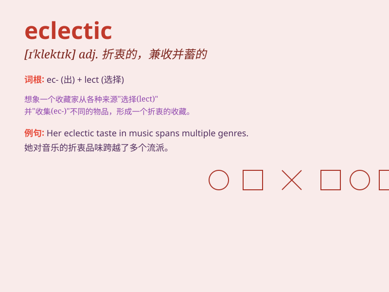

## eclectic

**英音:** _[ɪ\'klektɪk]_ **美音:** _[ɪ\'klɛktɪk]_

**译义:** *adj.折衷的,折衷学派的n.折衷主义者,折衷派的人*

### 短语

+ **eclectic collection:** _兼收并蓄的收藏_

+ **eclectic style:** _折衷主义风格_

+ **eclectic approach:** _兼收并蓄的方法_

+ **eclectic mix:** _多样化的混合_

+ **eclectic taste:** _兼收并蓄的品味_

### 例句

#### 例句1

> **The restaurant offers an eclectic menu that combines dishes from
various cuisines.**

**中文翻译:** 餐厅提供不拘一格的菜单，融合了各种美食的菜肴。

**单词释义:** 兼收并蓄的；博采众长的

#### 例句2

> **Her music taste is eclectic, ranging from classical to rock.**

**中文翻译:** 她的音乐品味不拘一格，从古典到摇滚。

**单词释义:** 不拘一格的；五花八门的

#### 例句3

> **The art exhibition showcases an eclectic collection of paintings
and sculptures.**

**中文翻译:** 艺术展览展示了不拘一格的绘画和雕塑收藏。

**单词释义:** 混合的；多元的

### 背诵小故事

> A young artist had an eclectic collection of art supplies. From
traditional brushes to modern digital tools, it was a mix. This showed
her eclectic taste, choosing the best from various sources. Just like
the word \'eclectic\' means selecting from diverse sources.

**一位年轻的艺术家拥有一套兼收并蓄的艺术用品。从传统的画笔到现代的数字工具，种类繁多。这展现了她兼收并蓄的品味，从各种来源中选择最好的。就像\'eclectic\'这个词的意思是从不同的来源中挑选。**

### 图义

