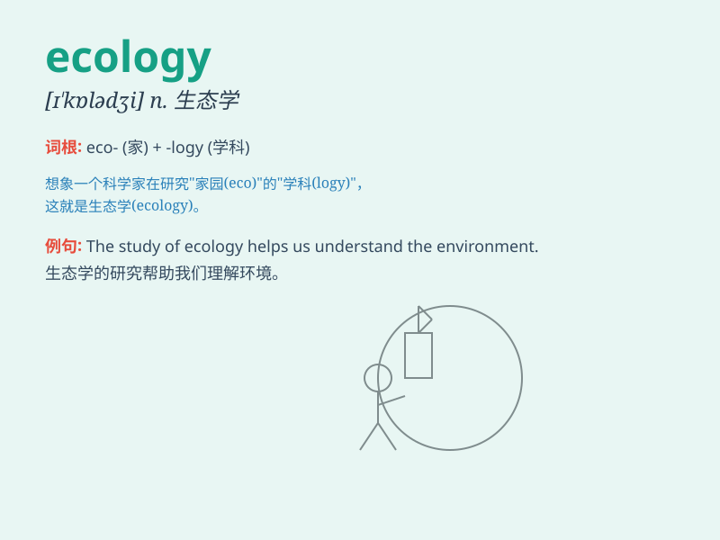

## ecology

**英音:** _[ɪ\'kɒlədʒɪ; e-]_ **美音:** _[ɪ\'kɑlədʒi]_

**译义:** *n.生态学,[社会]环境适应学,均衡系统*

### 短语

+ **ecological balance:** _生态平衡_

+ **ecological system:** _生态系统_

+ **ecological crisis:** _生态危机_

+ **ecological environment:** _生态环境_

+ **ecological footprint:** _生态足迹_

### 例句

#### 例句1

> **The study of ecology helps us understand the relationships
between organisms and their environment.**

**中文翻译:** 生态学的研究帮助我们理解生物和它们的环境之间的关系。

**单词释义:** 生态学

#### 例句2

> **We should protect the ecology of our planet to ensure a
sustainable future.**

**中文翻译:** 我们应该保护我们星球的生态以确保一个可持续的未来。

**单词释义:** 生态

#### 例句3

> **The damage to the local ecology was severe due to
deforestation.**

**中文翻译:** 由于森林砍伐，当地生态的破坏是严重的。

**单词释义:** 生态

### 背诵小故事

> A group of scientists went deep into the forest to study ecology.
They observed how different animals and plants interacted. They learned
that a balanced ecology is crucial for our planet\'s health.

**一群科学家深入森林去研究生态学。他们观察不同动植物如何相互作用。他们了解到平衡的生态对我们星球的健康至关重要。**

### 图义

