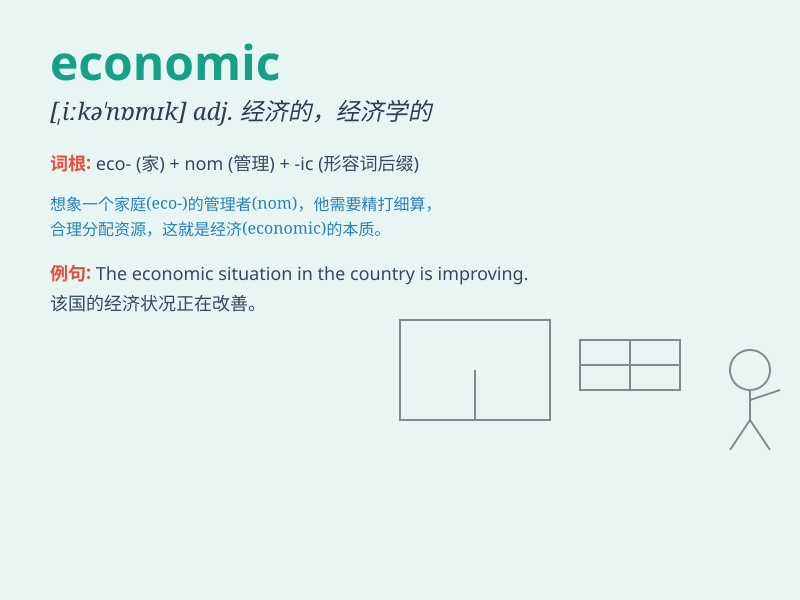

## economic

**英音:** _[,iːkə\'nɒmɪk; ek-]_ **美音:** _[ˌikəˈnɑmɪk,
ˌɛkəˈ-nɑmɪk]_

**译义:** *adj.经济(上)的,产供销的,经济学的*

### 短语

+ **economic growth:** _经济增长_

+ **economic development:** _经济发展_

+ **economic crisis:** _经济危机_

+ **economic system:** _经济体制_

+ **economic benefit:** _经济效益_

### 例句

#### 例句1

> **The economic situation is improving gradually.**

**中文翻译:** 经济形势正在逐渐改善。

**单词释义:** 经济的

#### 例句2

> **She studied economic theories in college.**

**中文翻译:** 她在大学里学习经济理论。

**单词释义:** 经济的；经济学的

#### 例句3

> **The new policy has a significant impact on the economic
development of the region.**

**中文翻译:** 新政策对该地区的经济发展有重大影响。

**单词释义:** 经济（上）的

### 背诵小故事

> A poor student wanted to study economic. He worked hard to understand
how money flows and businesses grow. Finally, he became an expert and
improved his life.

**一个贫困的学生想要学习经济。他努力去理解金钱如何流动以及企业如何发展。最终，他成为了专家，改善了自己的生活。**

### 图义

