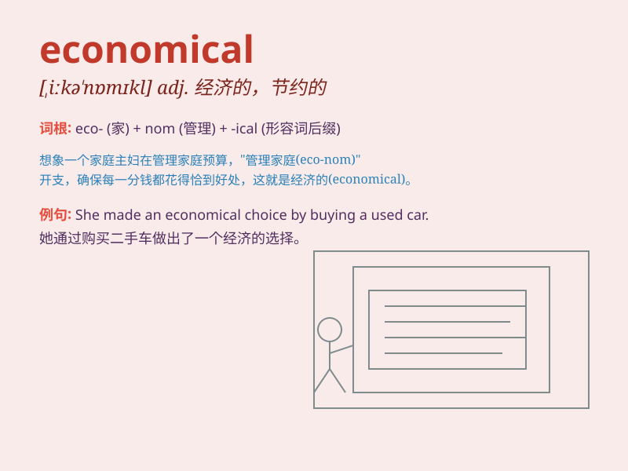

## economical

**英音:** _[iːkə\'nɒmɪk(ə)l; ek-]_ **美音:**
_[,ɛkə\'nɑmɪkl]_

**译义:** *adj.节约的,经济的*

### 短语

+ **economical efficiency:** _经济效率_

+ **economical growth:** _经济增长_

+ **economical situation:** _经济形势_

+ **economical system:** _经济体制_

+ **economical crisis:** _经济危机_

### 例句

#### 例句1

> **This new car is very economical on fuel.**

**中文翻译:** 这辆新车很省油。

**单词释义:** 节约的，节省的（指在燃料使用方面）

#### 例句2

> **She is economical with her time and money.**

**中文翻译:** 她在时间和金钱上都很节俭。

**单词释义:** 节俭的，节约的（指在时间和金钱使用方面）

#### 例句3

> **It\'s more economical to buy in bulk.**

**中文翻译:** 大批购买更经济实惠。

**单词释义:** 经济实惠的

### 背诵小故事

> A poor student needed to be economical. He saved money by taking the
cheapest bus, buying discounted food, and using old textbooks. Finally,
he managed his expenses well. \'Economical\' means careful and thrifty
in using money and resources.

**一个贫困的学生需要节俭。他通过乘坐最便宜的公交车、购买打折食品和使用旧教科书来省钱。最终，他很好地管理了自己的开支。"economical"意思是在使用金钱和资源方面谨慎且节俭。**

### 图义

