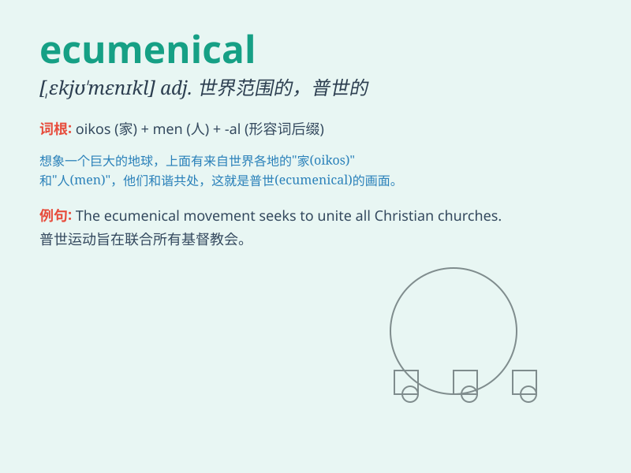

## ecumenical

**英音:** _[,iːkjʊ\'menɪk(ə)l; ek-]_ **美音:**
_[,ikju\'mɛnɪkl]_

**译义:** *adj.一般的,普通的*

### 短语

+ **ecumenical council:** _大公会议_

+ **ecumenical movement:** _普世教会运动_

+ **ecumenical spirit:** _普世精神_

+ **ecumenical dialogue:** _普世对话_

+ **ecumenical theology:** _普世神学_

### 例句

#### 例句1

> **The ecumenical movement aims to promote unity among different
Christian denominations.**

**中文翻译:** 普世运动旨在促进不同基督教教派之间的团结。

**单词释义:** 普世的；全基督教的

#### 例句2

> **The ecumenical council brought together religious leaders from
various parts of the world.**

**中文翻译:** 普世理事会汇集了来自世界各地的宗教领袖。

**单词释义:** 普世的；广泛的

#### 例句3

> **She has an ecumenical approach to solving religious disputes.**

**中文翻译:** 她以普世主义的方式解决宗教争端。

**单词释义:** 普世性的；包容一切的

### 背诵小故事

> A group of religious leaders from different churches came together
for an ecumenical meeting. They aimed to promote unity and understanding
among all faiths. The word \'ecumenical\' means promoting unity among
different religious groups or worldwide.

**一群来自不同教堂的宗教领袖聚在一起参加了一场普世教会合一会议。他们旨在促进所有信仰之间的团结和理解。\'ecumenical\'这个单词意为促进不同宗教团体或全球范围内的团结。**

### 图义

