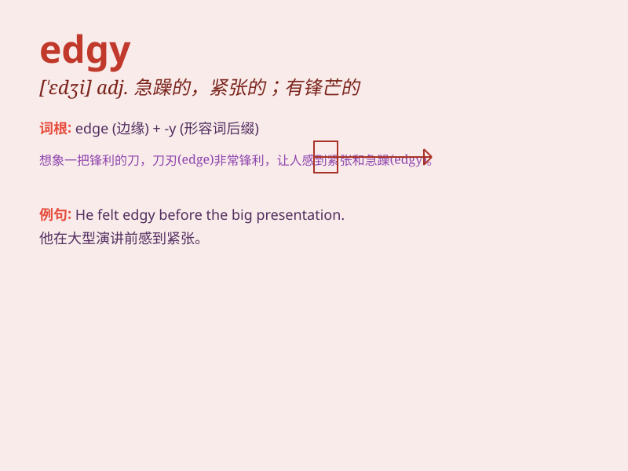

## edgy

**英音:** _[\'edʒɪ]_ **美音:** _[\'ɛdʒi]_

**译义:** *adj.刀口锐利的,急躁的,尖利的*

### 短语

+ **edgy mood:** _烦躁的情绪_

+ **edgy behavior:** _急躁的行为_

+ **feel edgy:** _感到紧张不安_

+ **edgy nerves:** _紧张的神经_

+ **an edgy situation:** _紧张的局势_

### 例句

#### 例句1

> **She\'s been feeling edgy ever since she got that bad news.**

**中文翻译:** 自从得知这个坏消息后，她就一直感到焦躁不安。

**单词释义:** 烦躁不安的；紧张的

#### 例句2

> **The atmosphere in the room was edgy as they waited for the
results.**

**中文翻译:** 房间里的气氛有些紧张，等待着结果。

**单词释义:** 紧张的；不安的

#### 例句3

> **His edgy performance on stage suggested he was very nervous.**

**中文翻译:** 他在舞台上的急躁表现表明他非常紧张。

**单词释义:** 紧张的；焦虑的

### 背诵小故事

> A young artist was always edgy before her exhibitions. She felt
nervous and restless, as if on the edge of a cliff. But with time, she
learned to control her emotions. Remember, \'edgy\' means nervous and
tense.

**一位年轻的艺术家在她的展览前总是感到紧张不安。她感到焦虑和烦躁，就好像在悬崖边缘。但随着时间的推移，她学会了控制自己的情绪。记住，\'edgy\'意思是紧张不安的。**

### 图义

