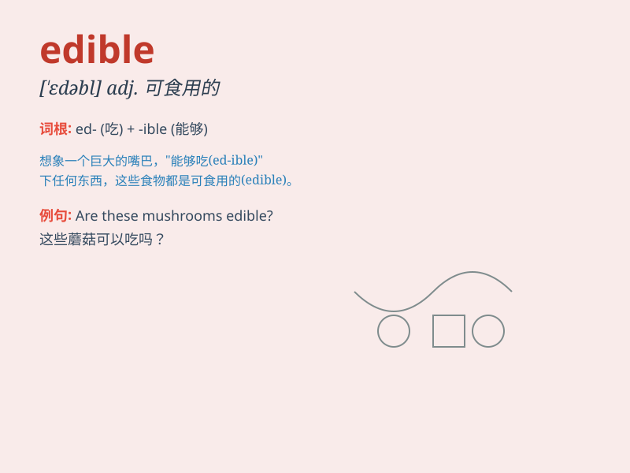

## edible

**英音:** _[ˈedəbl]_ **美音:** _[\'ɛdəbl]_

**译义:** *adj.可食用的*

### 短语

+ **edible oil:** _食用油_

+ **edible mushroom:** _食用蘑菇_

+ **edible plant:** _可食用植物_

+ **edible fruit:** _可食用的水果_

+ **edible part:** _可食用部分_

### 例句

#### 例句1

> **The mushrooms in this forest are not all edible.**

**中文翻译:** 这片森林里的蘑菇并不都是可以吃的。

**单词释义:** 可食用的

#### 例句2

> **Only a few plants in the desert are edible for humans.**

**中文翻译:** 沙漠中只有少数植物可供人类食用。

**单词释义:** 可食用的

#### 例句3

> **The new food product is labeled as edible and safe for
consumption.**

**中文翻译:** 新食品被标记为可食用且可安全食用。

**单词释义:** 可食用的

### 背诵小故事

> Once upon a time, a hungry traveler was lost in the forest. Luckily,
he found some fruits and wondered if they were edible. He took a bite
and felt relieved as they were delicious and safe to eat.

**从前，有个饥饿的旅行者在森林里迷路了。幸运的是，他发现了一些水果，想知道它们是否可食用。他咬了一口，感到欣慰，因为它们美味且能安全食用。**

### 图义

