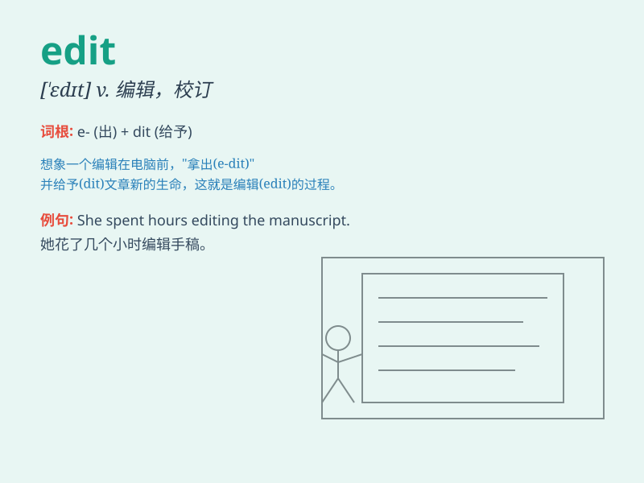

## edit

**英音:** _[\'edɪt]_ **美音:** _[\'ɛdɪt]_

**译义:** *vt.编辑,校订,剪辑n.编辑工作*

### 短语

+ **edit out:** _删除；删去_

+ **edit together:** _共同编辑；一起编辑_

+ **edit for:** _为\...\...编辑_

+ **edit from:** _从\...\...编辑_

+ **edit into:** _编辑成_

### 例句

#### 例句1

> **I need to edit this document before submitting it.**

**中文翻译:** 我需要在提交之前编辑该文档。

**单词释义:** 修改；编辑

#### 例句2

> **She edits the school newspaper.**

**中文翻译:** 她编辑校报。

**单词释义:** 编辑；校订

#### 例句3

> **The film was edited to make it shorter.**

**中文翻译:** 这部电影经过剪辑，使其变得更短。

**单词释义:** 剪辑；剪接

### 背诵小故事

> One day, a writer was struggling to perfect his story. Then an
\'edit\' fairy appeared and magically fixed all the grammar mistakes and
made the plot more coherent. With the fairy\'s help, the story became
wonderful!

**一天，一位作家正在努力完善他的故事。这时，一个"编辑"仙女出现了，神奇地修正了所有语法错误，并让情节更连贯。在仙女的帮助下，这个故事变得精彩起来！**

### 图义

