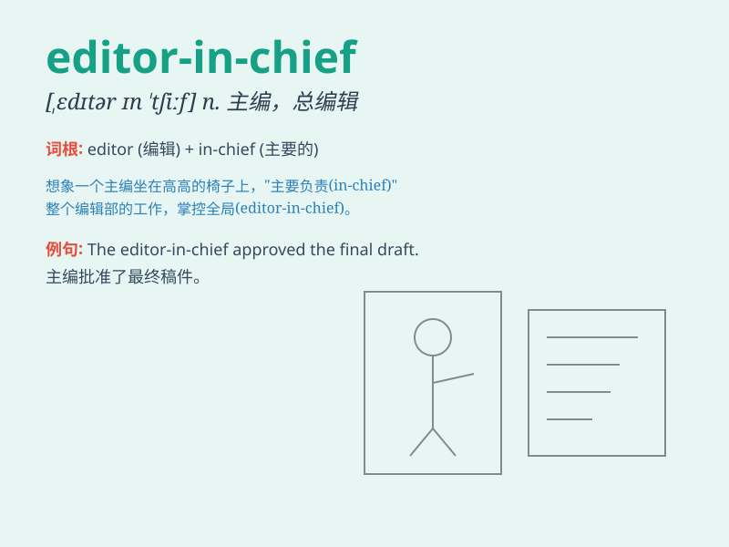

## editor-in-chief

**英音:** _[ˌedɪtə ɪn ˈtʃiːf]_ **美音:** _[ˌedɪtər ɪn
ˈtʃiːf]_

**译义:** *n.总编辑；主编*

### 短语

+ **assistant editor-in-chief:** _助理主编_

+ **former editor-in-chief:** _前主编_

+ **new editor-in-chief:** _新主编_

+ **deputy editor-in-chief:** _副主编_

+ **honorary editor-in-chief:** _名誉主编_

### 例句

#### 例句1

> **The editor-in-chief made the final decision on the article.**

**中文翻译:** 主编对这篇文章做出了最终决定。

**单词释义:** 主编

#### 例句2

> **She was promoted to editor-in-chief of the fashion magazine.**

**中文翻译:** 她被提升为时尚杂志的主编。

**单词释义:** 主编

#### 例句3

> **The editor-in-chief is responsible for the overall quality of the
publication.**

**中文翻译:** 主编负责出版物的整体质量。

**单词释义:** 主编

### 背诵小故事

>
想象一家大报社，有个神秘的人物掌控全局，决定着每篇报道的走向，这个人就是
editor-in-chief（主编）。他像船长一样引领着整个编辑团队，确保每一个选题都精彩绝伦。

**想象一家报社中掌控全局的主编，像船长引领编辑团队，确保选题精彩，以此记住\'editor-in-chief（主编）\'这个单词。**

### 图义

