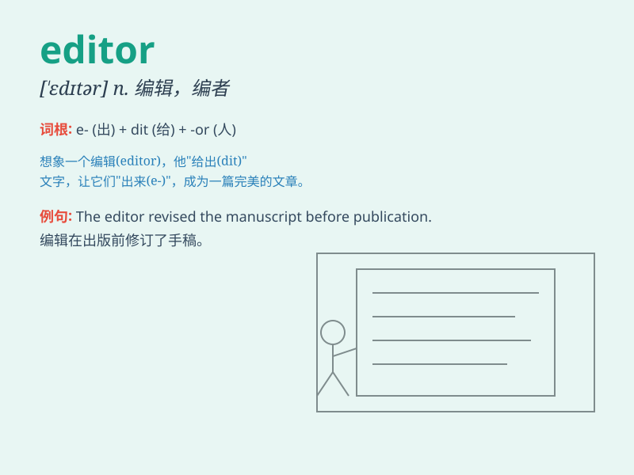

## editor

**英音:** _[\'edɪtə]_ **美音:** _[\'ɛdɪtɚ]_

**译义:** *n.编辑,编辑器,编者*

### 短语

+ **chief editor:** _主编；总编辑_

+ **assistant editor:** _助理编辑_

+ **text editor:** _文本编辑器_

+ **video editor:** _视频编辑_

+ **photo editor:** _图片编辑_

### 例句

#### 例句1

> **The editor made several revisions to the article.**

**中文翻译:** 编辑对文章进行了多次修改。

**单词释义:** 编辑

#### 例句2

> **She works as an editor for a fashion magazine.**

**中文翻译:** 她是一家时尚杂志的编辑。

**单词释义:** 编辑

#### 例句3

> **The editor-in-chief approved the final draft.**

**中文翻译:** 主编批准了终稿。

**单词释义:** 编辑；主编

### 背诵小故事

> A young journalist dreamt of becoming an editor. One day, she got a
chance to edit an important article. With great care and wisdom, she
made it perfect. Finally, she achieved her dream and became a famous
editor.

**一位年轻的记者梦想成为一名编辑。有一天，她得到了编辑一篇重要文章的机会。她小心翼翼且充满智慧，将其编辑得完美无缺。最终，她实现了梦想，成为了一位著名的编辑。**

### 图义

