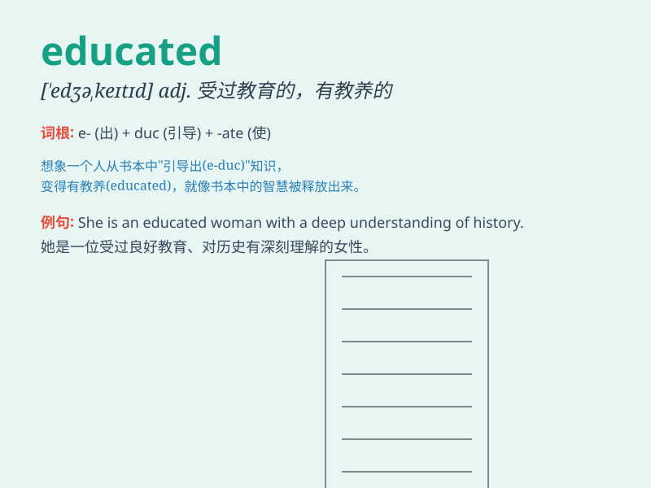

## educated

**英音:** _[\'edjʊkeɪtɪd]_ **美音:** _[\'ɛdʒə\'ketɪd]_

**译义:** *adj.受过教育的,有教养的*

### 短语

+ **educated guess:** _凭知识或经验所作的猜测_

+ **educated choice:** _有根据的选择_

+ **educated opinion:** _有学识的见解_

+ **well-educated:** _受过良好教育的_

+ **educated workforce:** _受过教育的劳动力_

### 例句

#### 例句1

> **She is an educated woman with a master\'s degree.**

**中文翻译:** 她是一位拥有硕士学位的受过教育的女性。

**单词释义:** 有教养的；受过教育的

#### 例句2

> **The educated youth went to the countryside to learn from the
farmers.**

**中文翻译:** 知青下乡向农民学习。

**单词释义:** 受过教育的

#### 例句3

> **He gave an educated guess based on his experience.**

**中文翻译:** 他根据自己的经验给出了有根据的猜测。

**单词释义:** 有学识的；有根据的

### 背诵小故事

> Once upon a time, there was a poor boy. With great determination, he
read many books and took various courses. Finally, he became an educated
person and found a wonderful job.

**从前，有一个贫穷的男孩。凭借极大的决心，他读了很多书，参加了各种课程。最终，他成为了一个受过教育的人，并找到了一份很棒的工作。**

### 图义

