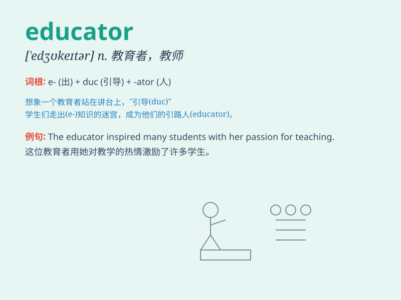

## educator

**英音:** _[\'edʒʊkeɪtə]_ **美音:** _[\'ɛdʒə\'ketɚ]_

**译义:** *n.教育家*

### 短语

+ **professional educator:** _专业教育工作者_

+ **experienced educator:** _经验丰富的教育者_

+ **innovative educator:** _创新型教育者_

+ **effective educator:** _高效的教育者_

+ **passionate educator:** _充满激情的教育者_

### 例句

#### 例句1

> **The educator inspired students to pursue their dreams.**

**中文翻译:** 教育家激励学生追求自己的梦想。

**单词释义:** 教育工作者

#### 例句2

> **She is a well-known educator in the field of early childhood
education.**

**中文翻译:** 她是幼儿教育领域的知名教育家。

**单词释义:** 教育工作者

#### 例句3

> **The educator designed an innovative teaching method to enhance
students\' learning experience.**

**中文翻译:** 教育者设计了创新的教学方法来增强学生的学习体验。

**单词释义:** 教育工作者

### 背诵小故事

> Once upon a time, there was a kind person named Tom. He loved
teaching kids and sharing knowledge. Everyone called him an educator
because he had the power to educate and inspire.

**从前，有个善良的人叫汤姆。他喜欢教孩子和分享知识。大家都称他为教育家，因为他有教育和激励的力量。**

### 图义

