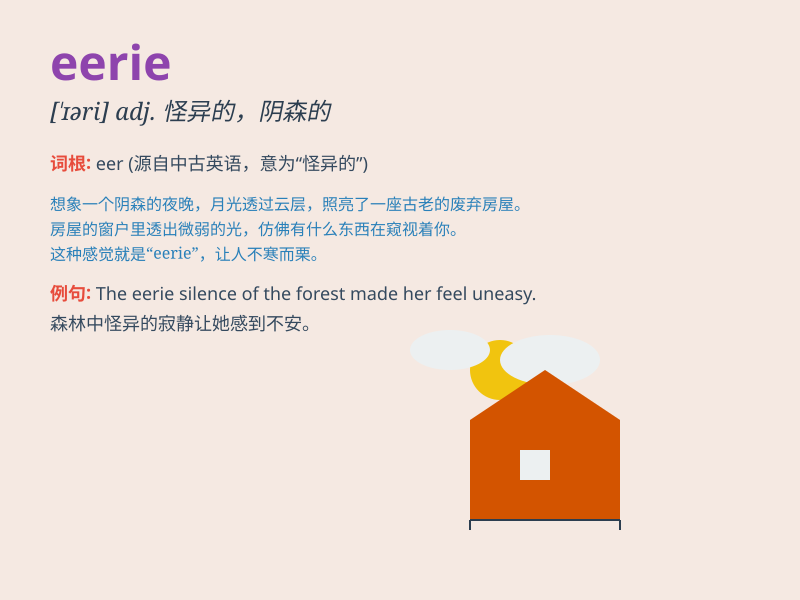

## eerie

**英音:** _[ˈɪəri]_ **美音:** _[ˈɪri]_

**译义:** *adj.怪诞的,可怕的,不安的,奇异的*

### 短语

+ **eerie silence:** _怪异的寂静_

+ **eerie feeling:** _怪异的感觉_

+ **eerie light:** _怪异的光_

+ **eerie sound:** _怪异的声音_

+ **eerie atmosphere:** _怪异的氛围_

### 例句

#### 例句1

> **The old house had an eerie silence.**

**中文翻译:** 老房子里一片诡异的寂静。

**单词释义:** 怪异的；神秘的；可怕的

#### 例句2

> **The eerie sound in the forest made me shiver.**

**中文翻译:** 森林里诡异的声音让我不寒而栗。

**单词释义:** 令人毛骨悚然的；阴森恐怖的

#### 例句3

> **The moonlit night gave the landscape an eerie glow.**

**中文翻译:** 月夜给大地带来了诡异的光芒。

**单词释义:** 神秘的；奇异的

### 背诵小故事

> One night, I was walking alone in an old forest. The silence and
strange shadows made me feel eerie. Suddenly, a strange sound came from
behind, scaring me a lot. I realized that eerie means strange and
frightening.

**一天晚上，我独自走在一片古老的森林里。寂静和奇怪的阴影让我感到毛骨悚然。突然，身后传来一个奇怪的声音，把我吓得够呛。我明白了eerie意思是怪异可怕的。**

### 图义

