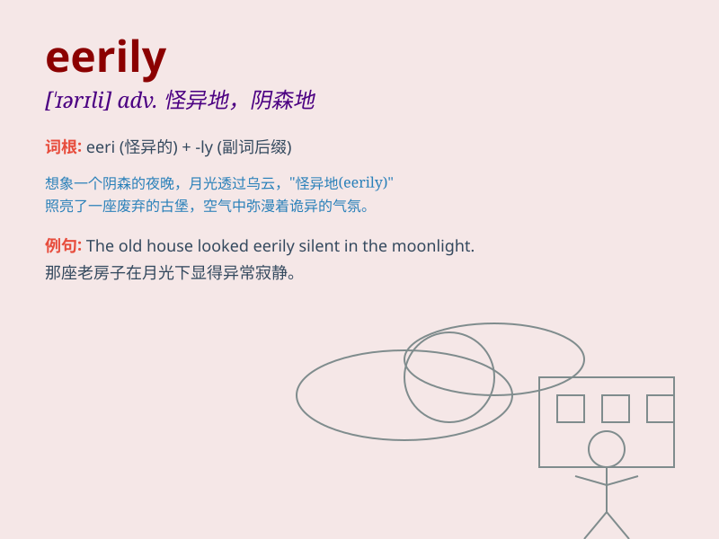

## eerily

**英音:** _[ˈɪərɪli]_ **美音:** _[ˈɪrɪli]_

**译义:** *adv. 怪异地；阴森恐怖地；神秘地*

### 短语

+ **eerily quiet:** _异常安静_

+ **eerily similar:** _惊人地相似_

+ **eerily beautiful:** _奇异的美_

+ **eerily calm:** _出奇地平静_

+ **eerily deserted:** _异常荒凉_

### 例句

#### 例句1

> **The old house was eerily silent at night.**

**中文翻译:** 这座老房子在晚上异常安静。

**单词释义:** 奇怪地；神秘地；令人毛骨悚然地

#### 例句2

> **The fog hung eerily over the deserted town.**

**中文翻译:** 雾气神秘地笼罩着这个荒芜的城镇。

**单词释义:** 怪异地；可怕地

#### 例句3

> **She smiled eerily, giving me chills down my spine.**

**中文翻译:** 她笑得令人毛骨悚然，让我脊背发凉。

**单词释义:** 令人恐惧地；怪异可怕地

### 背诵小故事

> One night, I walked in the forest. The moonlight shone eerily through
the trees. Suddenly, I heard strange noises. It was an eerily quiet and
spooky place. I hurried home, scared.

**一天晚上，我在森林里散步。月光透过树木，怪异地照耀着。突然，我听到奇怪的声音。这是一个异常安静和令人毛骨悚然的地方。我害怕地赶紧回家。**

### 图义

