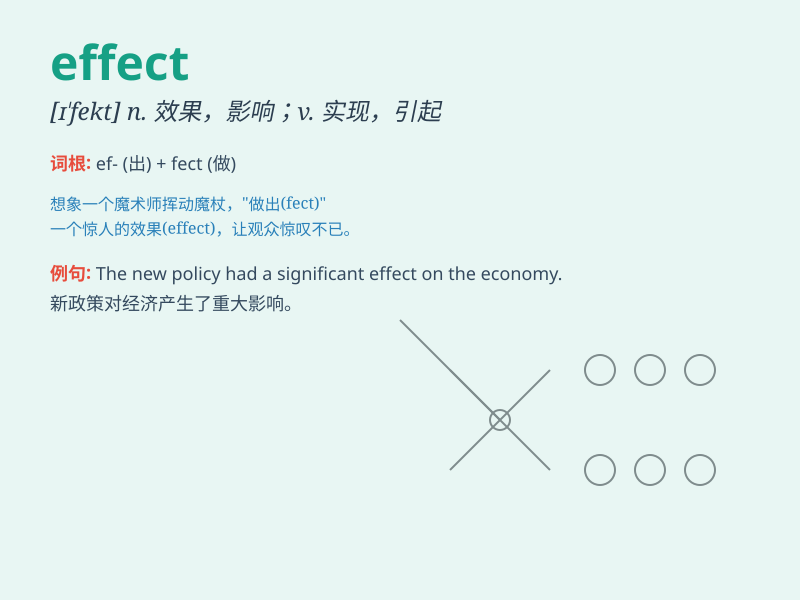

## effect

**英音:** _[ɪ\'fekt]_ **美音:** _[ɪ\'fɛkt]_

**译义:**
*n.结果,效果,作用,影响,(在视听方面给人流下的)印象vt.招致,实现,达到(目的等)*

### 短语

+ **take effect:** _生效；起作用_

+ **come into effect:** _开始生效；开始实施_

+ **in effect:** _实际上；事实上_

+ **side effect:** _副作用_

+ **effect on:** _对\...\...的影响_

### 例句

#### 例句1

> **The new law will come into effect next month.**

**中文翻译:** 新法律将于下个月生效。

**单词释义:** 生效

#### 例句2

> **The medicine had no effect on his illness.**

**中文翻译:** 药物对他的病没有效果。

**单词释义:** 效果

#### 例句3

> **Her words had a profound effect on me.**

**中文翻译:** 她的话对我产生了深远的影响。

**单词释义:** 影响

### 背诵小故事

> A scientist was conducting experiments. After many tries, he finally
got a result that had a great effect. It changed people\'s lives and
made the world a better place.

**一位科学家正在进行实验。经过多次尝试，他最终得到了一个有重大影响的结果。它改变了人们的生活，让世界变得更美好。**

### 图义

