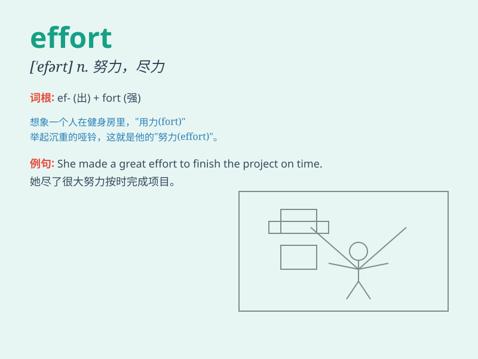

## effort

**英音:** _[\'efət]_ **美音:** _[\'ɛfɚt]_

**译义:** *n.努力,成就*

### 短语

+ **make an effort:** _作出努力_

+ **spare no effort:** _不遗余力；竭尽全力_

+ **put effort into:** _把精力投入到\...\..._

+ **in an effort to:** _企图（努力想）；试图要_

+ **concerted effort:** _齐心协力；协同努力_

### 例句

#### 例句1

> **I made a great effort to finish the project on time.**

**中文翻译:** 我付出了很大的努力才按时完成了这个项目。

**单词释义:** 努力

#### 例句2

> **It doesn\'t require much effort to learn this skill.**

**中文翻译:** 学习这项技能并不需要太多努力。

**单词释义:** 努力

#### 例句3

> **His effort to save the drowning child was heroic.**

**中文翻译:** 他为救溺水儿童所做的努力是英勇的。

**单词释义:** 努力

### 背诵小故事

>
小明一直梦想在跑步比赛中获奖，他每天早起训练，付出了很多effort。即使累得气喘吁吁，也从不放弃。最终，他的努力得到了回报，站在了领奖台上。

**小明一直梦想在跑步比赛中获奖，他每天早起训练，付出了很多努力。即使累得气喘吁吁，也从不放弃。最终，他的努力得到了回报，站在了领奖台上。**

### 图义

