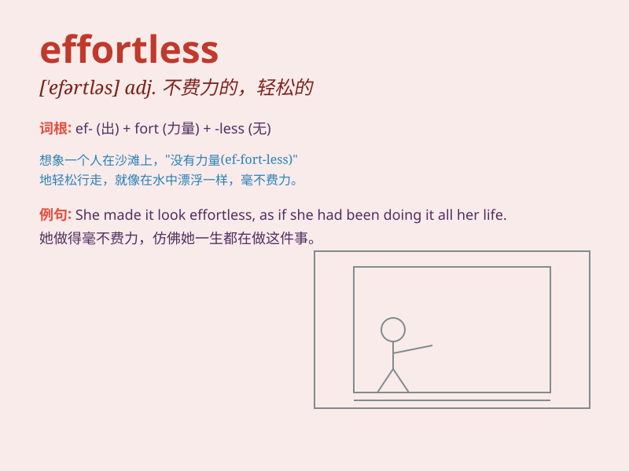

## effortless

**英音:** _[\'efətlɪs]_ **美音:** _[\'ɛfɚtləs]_

**译义:** *adj.容易的,不费力气的*

### 短语

+ **effortless beauty:** _毫不费力的美_

+ **effortless style:** _轻松的风格_

+ **effortless charm:** _自然的魅力_

+ **effortless movement:** _轻松的动作_

+ **effortless success:** _轻而易举的成功_

### 例句

#### 例句1

> **She made the difficult dance look effortless.**

**中文翻译:** 她让困难的舞蹈看起来毫不费力。

**单词释义:** 毫不费力的

#### 例句2

> **His effortless charm always attracts a lot of people.**

**中文翻译:** 他那毫不费力的魅力总是吸引着很多人。

**单词释义:** 自然流露的

#### 例句3

> **The athlete\'s performance was effortless and impressive.**

**中文翻译:** 这位运动员的表现毫不费力，令人印象深刻。

**单词释义:** 轻松自如的

### 背诵小故事

> A young artist was painting. With years of practice, her strokes
became effortless. She didn\'t struggle or force; the beauty emerged
naturally. It was as if her hands had a magic touch, creating
masterpieces without effort.

**一位年轻的艺术家正在作画。经过多年的练习，她的笔触变得毫不费力。她没有挣扎或用力；美自然而然地呈现出来。仿佛她的手有神奇的触感，毫不费力地创作出杰作。**

### 图义

