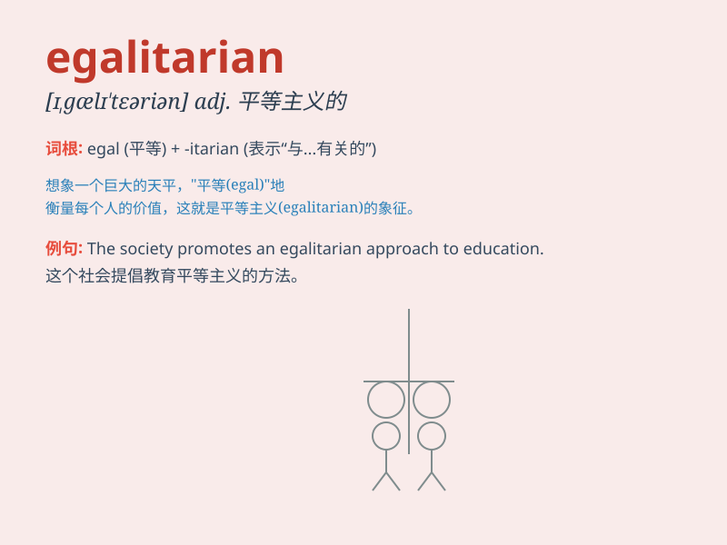

## egalitarian

**英音:** _[ɪ,gælɪ\'teərɪən]_ **美音:**
_[ɪ\'gælə\'tɛrɪən]_

**译义:** *adj.平等主义的n.平等主义*

### 短语

+ **egalitarian society:** _平等主义社会_

+ **egalitarian principle:** _平等主义原则_

+ **egalitarian ideology:** _平等主义思想_

+ **egalitarian approach:** _平等主义方法_

+ **egalitarian policy:** _平等主义政策_

### 例句

#### 例句1

> **The company has an egalitarian culture where everyone\'s opinions
are valued.**

**中文翻译:** 公司拥有平等的文化，每个人的意见都受到重视。

**单词释义:** 平等主义的

#### 例句2

> **She is a strong advocate of egalitarian principles in
education.**

**中文翻译:** 她是教育平等原则的坚定倡导者。

**单词释义:** 平等主义的

#### 例句3

> **The society strives to achieve an egalitarian distribution of
wealth.**

**中文翻译:** 社会努力实现财富分配的平等。

**单词释义:** 平等主义的

### 背诵小故事

> In a small village, everyone was treated equally. There was no
hierarchy or discrimination. This village was a perfect example of an
egalitarian society, where all had the same rights and opportunities.

**在一个小村庄里，每个人都被平等对待。没有等级之分或歧视。这个村庄是平等主义社会的完美典范，所有人都有相同的权利和机会。**

### 图义

