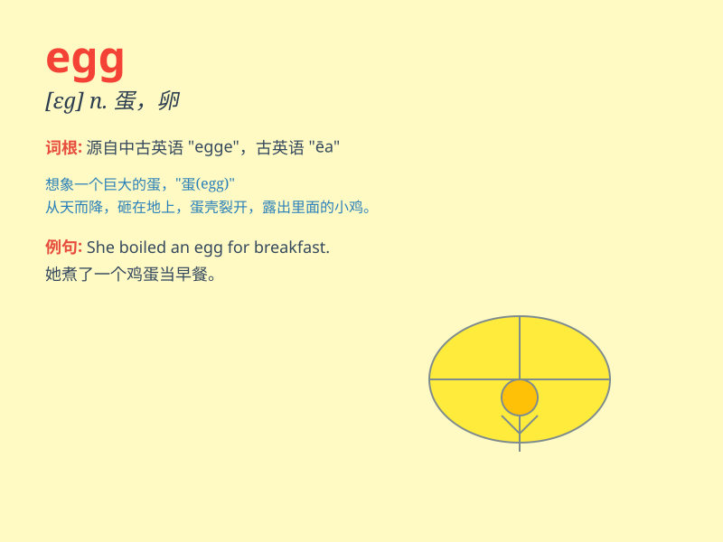

## egg

**英音:** _[eg]_ **美音:** _[ɛɡ]_

**译义:** *n.蛋,鸡蛋,卵v.怂恿,怂恿*

### 短语

+ **egg white:** _蛋清；蛋白_

+ **egg yolk:** _蛋黄_

+ **fried egg:** _煎蛋_

+ **poached egg:** _荷包蛋_

+ **scrambled egg:** _炒蛋_

### 例句

#### 例句1

> **I had an egg for breakfast.**

**中文翻译:** 我早餐吃了一个鸡蛋。

**单词释义:** 鸡蛋

#### 例句2

> **The hen laid an egg yesterday.**

**中文翻译:** 母鸡昨天下了一个蛋。

**单词释义:** 蛋

#### 例句3

> **Don\'t put all your eggs in one basket.**

**中文翻译:** 不要把所有鸡蛋放在同一个篮子里。

**单词释义:** 鸡蛋

### 背诵小故事

> One day, a little chicken was looking for its egg. It searched
everywhere and finally found it under a big tree. The egg was so
beautiful and round, and the little chicken was very happy.

**一天，一只小鸡正在寻找它的蛋。它到处找，最后在一棵大树下找到了。这个蛋又漂亮又圆，小鸡非常高兴。**

### 图义

