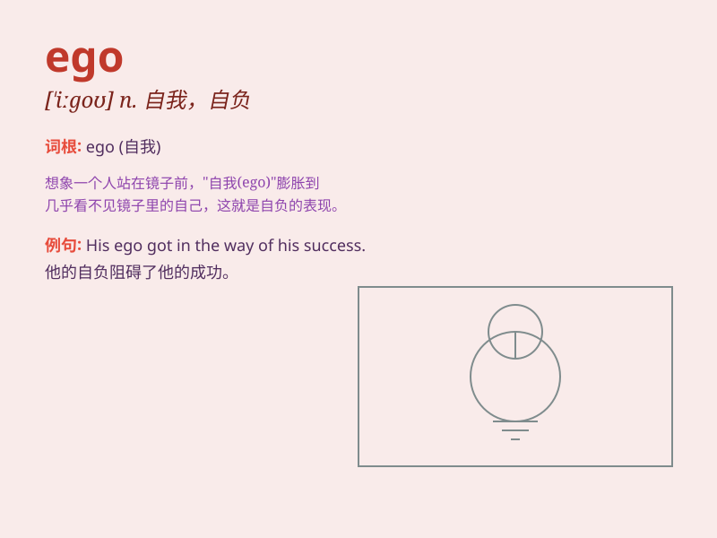

## ego

**英音:** _[\'iːgəʊ; \'e-]_ **美音:** _[\'iɡo]_

**译义:** *n.自我,利已主义,自负*

### 短语

+ **ego trip:** _自我表现；追求个人满足_

+ **ego boost:** _自我提升；增强自信心_

+ **ego defense:** _自我防卫；自我保护机制_

+ **inflated ego:** _膨胀的自我；自负_

+ **bruised ego:** _受伤的自尊心_

### 例句

#### 例句1

> **His ego was too big to admit his mistake.**

**中文翻译:** 他的自尊心太大，无法承认自己的错误。

**单词释义:** 自负；自我

#### 例句2

> **She has a fragile ego and is easily hurt by criticism.**

**中文翻译:** 她的自尊心很脆弱，很容易受到批评的伤害。

**单词释义:** 自尊心

#### 例句3

> **The star\'s ego often gets in the way of his relationships.**

**中文翻译:** 明星的自我意识经常妨碍他的人际关系。

**单词释义:** 自我意识

### 背诵小故事

> A man always boasted about his achievements, thinking he was the
best. But his excessive ego made others dislike him. One day, he
realized his mistake and learned to be humble. Ego means a person\'s
sense of self-importance.

**一个男人总是吹嘘自己的成就，认为自己是最棒的。但他过度的自我让别人不喜欢他。有一天，他意识到了自己的错误并学会了谦逊。Ego
意思是自我；自负；自尊心**

### 图义

