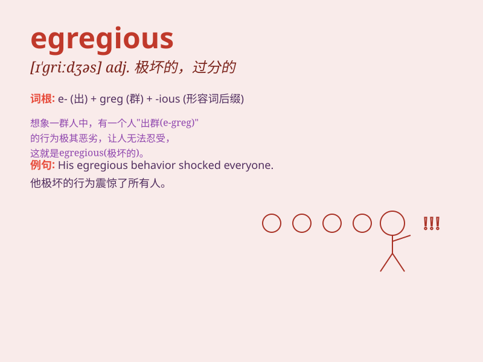

## egregious

**英音:** _[ɪ\'griːdʒəs]_ **美音:** _[ɪ\'gridʒɪəs]_

**译义:** *adj.异乎寻常的,过分的,惊人的*

### 短语

+ **egregious error:** _严重的错误_

+ **egregious crime:** _极恶的罪行_

+ **egregious violation:** _严重的违反_

+ **egregious misconduct:** _恶劣的不当行为_

+ **egregious example:** _极端的例子_

### 例句

#### 例句1

> **The politician\'s egregious corruption led to his downfall.**

**中文翻译:** 这位政客的严重腐败导致了他的垮台。

**单词释义:** 极其严重的；惊人的

#### 例句2

> **The company\'s egregious mistake cost them millions of
dollars.**

**中文翻译:** 该公司的严重错误使他们损失了数百万美元。

**单词释义:** 极坏的；恶劣的

#### 例句3

> **Her egregious behavior at the party was widely criticized.**

**中文翻译:** 她在聚会上的恶劣行为受到广泛批评。

**单词释义:** 极端恶劣的；异乎寻常的

### 背诵小故事

> A thief stole a huge amount of gold from a bank. His crime was so
egregious that everyone was shocked. The police worked hard to catch
him. Eventually, justice was served.

**一个小偷从银行偷走了大量的黄金。他的罪行极其恶劣，所有人都感到震惊。警察努力工作抓住了他。最终，正义得到了伸张。**

### 图义

