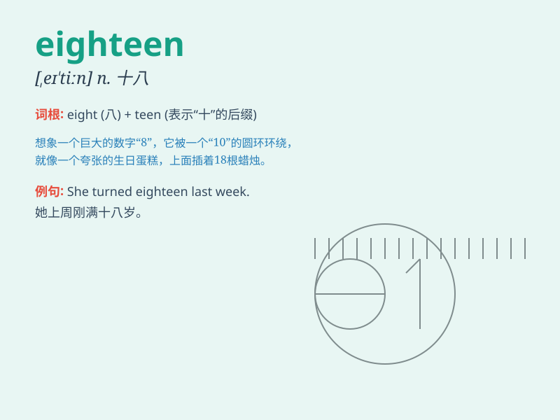

## eighteen

**英音:** _[eɪ\'tiːn; \'eɪtiːn]_ **美音:** _[,e\'tin]_

**译义:** *adj.十八的,十八个的*

### 短语

+ **eighteen years old:** _十八岁_

+ **at eighteen:** _在十八岁时_

+ **eighteen months:** _十八个月_

+ **over eighteen:** _超过十八岁_

+ **under eighteen:** _未满十八岁_

### 例句

#### 例句1

> **I am eighteen years old.**

**中文翻译:** 我今年十八岁。

**单词释义:** 十八（指年龄）

#### 例句2

> **There are eighteen students in the classroom.**

**中文翻译:** 教室里有十八名学生。

**单词释义:** 十八（数量）

#### 例句3

> **She bought eighteen apples from the market.**

**中文翻译:** 她从市场上买了十八个苹果。

**单词释义:** 十八（数量）

### 背诵小故事

> One day, I was at a party and met a special girl. I asked her age and
she said, \'I\'m eighteen.\' That number stuck in my mind. Eighteen, the
age of new adventures and dreams.

**有一天，我在一个派对上遇到了一个特别的女孩。我问她的年龄，她说：'我十八岁。'那个数字就印在了我的脑海里。十八，充满新冒险和梦想的年龄。**

### 图义

